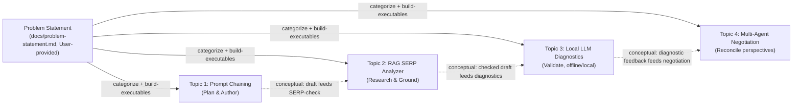
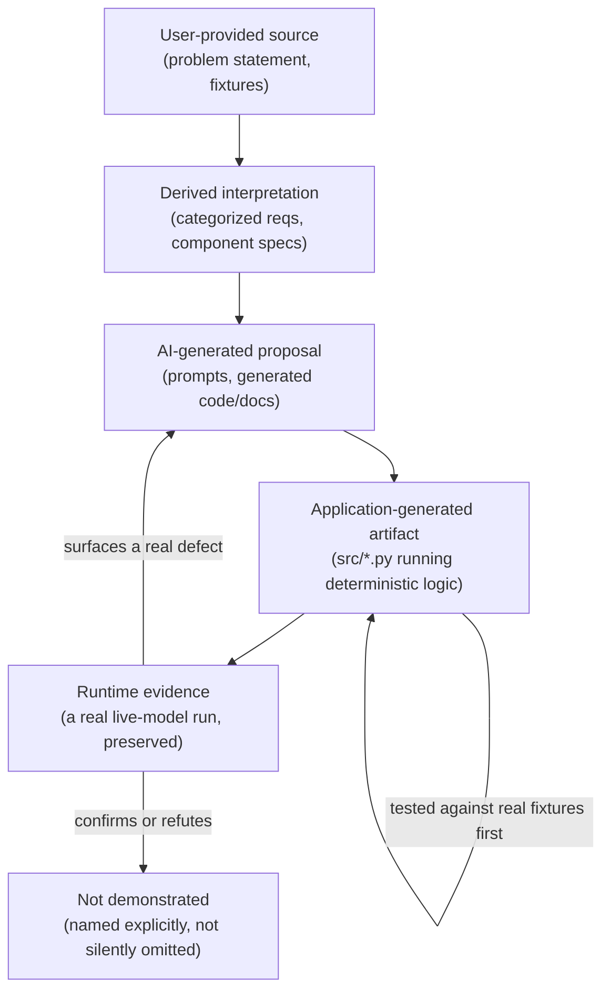
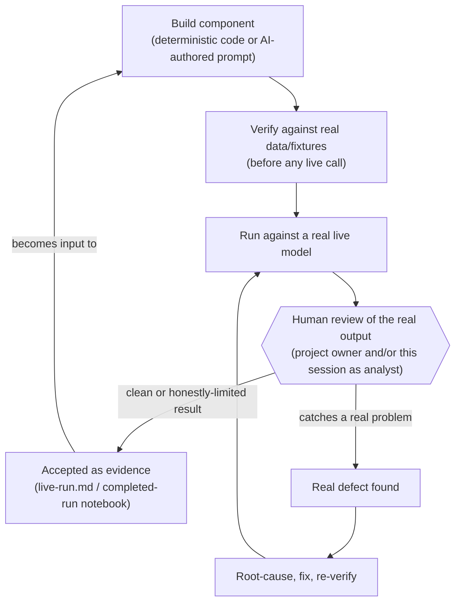

<!--
Traceability: the intended use of prompts/project-construction-meta-prompt.md
-- written now because this is the first point where all four topics have
real, evidence-backed results to draw on, not a build plan to describe (see
docs/postmortem-topic-1.md, item 2, for why the meta-prompt was never used as
a build plan). Follows that meta-prompt's Role/Goal/Instructions structure
and its 16-section document outline; every specific metric, quote, and
status value below is drawn from this repo's actual files -- the
meta-prompt's own illustrative example content (a "Qwen vs. Llama v0.4.8"
narrative, a paired-MAE metric, a "publication_blocked" state, a duplicate
JSON key) describes a different, hypothetical project and does not appear
anywhere in this document, per the meta-prompt's own rule against inventing
requirements or results absent from the source.
-->

# Four-Topic Project Execution Narrative

**Role**: evidence-based narrator of an AI-assisted SEO learning project,
covering what was requested, what was available, what was decided, how AI
and software actually interacted, what was produced, and what the evidence
does or does not support. Not a claim to legal, financial, compliance,
Google, or SEO authority.

## 1. Executive summary

Four independently-runnable AI/SEO prototypes were built against a shared
`docs/problem-statement.md`, each targeting a different mechanism: a
deterministic 3-stage prompt chain with a human checkpoint and a
self-correction loop (Topic 1); a RAG-grounded SERP analyzer with a
full-stack Gradio deployment (Topic 2); a QLoRA-fine-tuned local LLM content
auditor (Topic 3); and a two-agent LangGraph negotiation loop (Topic 4). All
four now have real, live-model evidence behind them, not fixture-only
demonstrations — each was run at least once against an actual Azure OpenAI
deployment (Topics 1, 2, 4) or a real fine-tuned local model (Topic 3), and
each live run surfaced at least one genuine defect that a fixture run could
not have exposed, which was root-caused, fixed, and re-verified.

Grades, self-assessed against each topic's own evaluation criteria and
recorded in `docs/postmortem-topic-{1,2,3,4}.md`:

| Topic | Grade | Recorded where |
|---|---|---|
| 1 — Prompt Chaining | A- (by inference) | Topic 1's own postmortem does not restate a letter grade; Topic 2's postmortem explicitly places Topic 1 in "the same tier ... for different reasons" |
| 2 — RAG SERP Analyzer | A- | `docs/postmortem-topic-2.md` |
| 3 — Local LLM SEO Diagnostics | A- | `docs/postmortem-topic-3.md` |
| 4 — Multi-Agent Conflict Resolution | A- | `docs/postmortem-topic-4.md` |

The consistent A- across four independently-built topics is not a
coincidence of grading style — each postmortem lands there for a different,
specific reason (an unaudited-final-paragraph bug in Topic 1; a
known-and-accepted limitation left unfixed in Topic 2; a foreseeable QLoRA
setup gap plus two self-caught reporting errors in Topic 3; a verification
blind spot and a foreseeable model-quirk in Topic 4). Section 13 states each
plainly. What stays constant across all four is the discipline that produced
them: check real data before building on assumptions about it; flag every
undefaulted engineering decision instead of silently picking one; test
against a live model, not just a fixture, because fixtures cannot exercise a
system's actual failure paths; and root-cause every live-run defect with a
documented explanation before calling it fixed.

## 2. Project-wide input and provenance inventory

| Item | Provenance | Notes |
|---|---|---|
| `docs/problem-statement.md` (root) | **User-provided source** | The original combined four-topic assessment text, in Chinese; each topic's `docs/problem-statement.md` is a verbatim extract of its own section. |
| `data/SERP_Data.json` | **User-provided source** | Simulated SERP results for Topic 2; explicitly a fixture, not live search data. |
| `data/Manual.txt` | **User-provided source** | 3-line internal compliance manual, entirely mortgage/interest-rate-specific — used by Topic 2 (RAG) and Topic 4 (Auditor reference); its real scope (see §6, §7) was discovered by reading it, not assumed from its description. |
| `data/SEO 診斷測試數據樣本.csv` | **User-provided source** | 20 labeled content snippets for Topic 3, including planted misinformation. |
| Each topic's `docs/problem-statement-categorized.md` | **Derived interpretation** | Produced by `master-prompt.md`'s `categorize-topic-requirement` procedure; every bullet keeps a source ID (B1, B2, ...) back to the original text. |
| Each topic's `docs/component-specs.md` and `prompts/*.md` | **Derived interpretation** + **AI-generated proposal** | Produced by `build-topic-executables`; component classification (deterministic/dynamic/hybrid/human) is a derived judgment, the prompt text itself is an AI-authored artifact reviewed and used as-is. |
| Each topic's `src/*.py` | **Application-generated artifact** | Deterministic code: orchestration, schema validation, retrieval, rendering. Not itself a language-model output. |
| Each topic's Colab notebook (`topic{N}_end_to_end_colab.ipynb`) | **Application-generated artifact** | Verbatim-ported from `src/` (Topics 1, 2, 4) or authored directly as the deliverable itself (Topic 3, per its own B15). |
| Each topic's *completed-run* notebook / `docs/live-run.md` | **Runtime evidence** | The actual preserved output of a real execution — real Azure OpenAI calls (Topics 1, 2, 4) or a real fine-tuned local model (Topic 3). This is the only category of evidence this narrative treats as proof that a mechanism actually works, as opposed to being correctly specified. |
| `prompts/project-construction-meta-prompt.md` | **User-provided source**, describing a **different, hypothetical project** | Determined in Topic 1's first session not to be a build plan for this project — its illustrative content (specific metrics, a specific model-selection narrative) does not match this repo. Its Role/Goal/Instructions structure is what this document follows; its example content is not reused anywhere below. |
| This document | **Derived interpretation**, synthesized from all of the above | Not a new build — no code, prompt, or requirement was created to produce this narrative; it reports what the repo's existing artifacts already show. |

Superseded/historical items, named so they are not mistaken for current
state: `docs/architecture.md` carried a stale, pre-Topic-1 note assuming
Topic 4 would use a local Llama-based model — superseded once Topic 4's
backend was decided (§7); the file's own "Resolved" section records this.
No API keys, tokens, or the project's `AUTH_CODE` secret appear anywhere in
this document.

## 3. Problem-statement-to-execution method

The actual pipeline used across all four topics, defined in
`prompts/master-prompt.md`:

1. **`categorize-topic-requirement`** — splits a topic's problem statement
   into self-contained, ID-tagged bullets (B1, B2, ...) and maps each to
   Role / Objective / Constraints / Reference / Deliverables / Evaluation
   Criteria. Run once per topic; each topic's `docs/problem-statement-categorized.md`
   is the output, with a "run notes" section stating whether categorization
   was fully feasible and naming any correction made (e.g. Topic 2's dropped
   B2 bullet, restored on review; Topic 1's two procedure bugs — a stale
   input path and an incomplete category list — found and fixed before
   Topics 2-4 ran the same procedure).
2. **`build-topic-executables`** — classifies each Objective as
   `deterministic` (pure code), `dynamic` (an LLM/agent call requiring
   language judgment), `hybrid` (deterministic orchestration wrapping one or
   more dynamic calls), or `human` (a design decision this project added as
   a fourth category, first named in Topic 1's component-specs for its
   intent-selection checkpoint). Each dynamic component gets a compressed
   Role/Goal/Instructions prompt (`prompts/*.md`); each deterministic one
   gets a function-level spec in `docs/component-specs.md`, alongside an
   orchestration diagram and an explicit "run notes" section flagging every
   engineering default not dictated by the source text.
3. **Build, then verify against real data before any live model call.**
   Every topic tested its deterministic logic against the actual project
   fixtures (not synthetic stand-ins) before spending a live API call —
   this is where Topic 2 caught a UTF-8 BOM and a wrong chunking assumption,
   and where Topic 4 caught, by reading `data/Manual.txt` directly, that it
   has no casino-related rule at all.
4. **Run live, expect and record real defects.** Every topic's live run
   (Azure OpenAI for Topics 1/2/4, a real fine-tuned local model for Topic
   3) surfaced at least one genuine bug a fixture run could not have
   exposed (§13 lists all of them). Each was root-caused with a written
   explanation, fixed, and re-verified — not just patched.
5. **Document honestly, including what didn't work.** Every topic has a
   `docs/component-specs.md` "run notes" section (engineering defaults
   flagged `[needs review]`, deviations from the literal source explained)
   and a project-root `docs/postmortem-topic-N.md` (chronology, a
   self-assigned grade, what worked, what didn't, what's reusable). This
   document is the first point all four of those postmortems exist and can
   be read across each other.

`prompts/project-construction-meta-prompt.md` was explicitly **not** used
as a step in this pipeline — determined in Topic 1's first session to be a
documentation template for a different, already-finished project (see
§2's note and `docs/postmortem-topic-1.md`, item 2). Its structure is what
this document itself follows, now that the pipeline above has produced real
results to narrate.

## 4. Topic 1 construction — Prompt Chaining

### Beginning

The problem (B1-B3, B6): the keyword `[娛樂城]` (a Taiwanese term for online
casino platforms) is extremely SEO-competitive, and most content written for
it answers no one's actual question — it's generic, listicle-style, and
increasingly disfavored as search engines reward demonstrated Experience
over plain listings (B2). The task: an automated 3-stage prompt chain that
infers specific searcher intents, drafts a first-hand-experience simulation
for one of them, then runs a self-correction loop checking the draft against
EEAT/YMYL principles before it's considered final (B3, B5). Getting this
wrong in a way that matters: producing confident-sounding content for a
YMYL-adjacent topic (real money, real platforms) without any actual
verification mechanism behind its claims — exactly the failure mode Google's
own EEAT guidance targets.

### Input

User-provided: the keyword, fixed to `[娛樂城]` in the source text (B6).
No external sources were consulted for EEAT/YMYL definitions beyond a
research summary written to satisfy B4 (`docs/research-summary.md`) — this
is a **derived interpretation**, not an external citation, since B4 asks for
a summary, not sourced references. Missing information: the source names no
selection rule for which of Stage A's micro-intents Stage B should act on
(resolved as a human decision, §Process), and no retry cap for the
self-correction loop (resolved as a flagged default of 3, later shown by the
live run to be a real, binding constraint — see Conclusion).

### Process

Component classification (`docs/component-specs.md`): C1 (Chain
Orchestrator) is `deterministic`; C2 (Stage A, micro-intent modeling), C3
(Stage B, first-hand experience), C4a (Stage C audit), and C4b (Stage C
correction) are all `dynamic`; a new `human` category was introduced for
SEL, the intent-selection checkpoint — a person reviews Stage A's ≥4
candidate intents and picks one, splitting the orchestrator into two
resumable steps (`start_prompt_chain` / `resume_prompt_chain`) rather than
one blocking function. The self-correction loop (C4a ↔ C4b) runs up to a
flagged `retry_cap` of 3, chosen as an engineering default because the
source states no maximum.

A real, uncaught fragility in the source text itself was found and fixed
before any live run: every prompt template hardcoded the literal keyword
`[娛樂城]` in its own Role/Goal/Reference prose, in addition to
`src/prompts.py` already accepting `keyword` as a function argument — so
changing the CLI's `--keyword` flag had no actual effect. Fixed by
replacing every hardcoded mention with a `{keyword}` placeholder and
threading the run's actual keyword through every stage's prompt, not just
Stage A's.

Azure OpenAI was added as a second LLM backend (alongside an
`AnthropicLLMClient`) via a pluggable `LLMClient` Protocol, with a
`FixtureLLMClient` for control-flow testing without a live call — this
pattern (Protocol + real backend + Fixture) is reused, with topic-specific
extensions, in Topics 2 and 4.

### Output

Three independent evidentiary runs exist for B16, each explicitly
provenance-labeled: a fixture-based run (`docs/sample-run.md`), an
in-session live-generated run (`docs/iterative-record.md`), and a real
Azure OpenAI live run (`docs/live-run.md`). The live run is the one worth
narrating in detail:

```
start_prompt_chain("娛樂城") → 5 micro-intents (real Azure call)
SEL → human picks "找到適合自己裝置與玩法的遊戲體驗，並在註冊前確認介面與連線品質"
resume_prompt_chain(retry_cap=3)
  → Stage B draft → Audit v1: fail (5 reasons)
  → Correction v2 → Audit v2: fail (6 reasons)
  → Correction v3 → Audit v3: fail (6 reasons)
  → Correction v4 — retry_cap exhausted; loop stops
final_pass: false; stage_b_final = v4
```

This is real, honestly-reported evidence, not a demonstration engineered to
pass: all three audits kept finding new, substantive issues (progressively,
the paragraph disclosed more of its own limitations — no testing date, no
regulator name, no editorial review — but the audit correctly kept
demanding an actual checkable source, which a lone player's account
structurally cannot supply). Tracing `orchestrator.py:100-114` against this
run's `audit_trail` surfaced a real orchestrator bug: the loop's third and
final correction (v4) was generated *after* the third audit and returned as
`stage_b_final` without ever itself being audited — a defect only a
cap-exhausting live run could expose, since the fixture run had passed on
cycle 2 and never reached the cap. **Fixed** with a Python `for`/`else`
clause: on cap exhaustion, one bonus audit call checks the final correction
before it's returned, guaranteeing `stage_b_final` is always a version some
audit actually evaluated.

### Conclusion

Successfully demonstrated: a working 3-stage chain with a real human
checkpoint, a self-correction loop that found and escalated real EEAT/YMYL
gaps rather than rubber-stamping a draft, and a genuine live-run bug found
and fixed. Only partially demonstrated: a *passing* live run for this
specific keyword — none of the three provenance-labeled runs shows the live
model reaching `final_pass: true`, so the chain's happy path is proven only
by the fixture and in-session runs, not by the real Azure OpenAI deployment.
Learned: a retry cap chosen without a sourced rationale is genuinely
provisional, not a formality — 3 cycles proved structurally insufficient for
a keyword this YMYL-sensitive, and the boundary condition it created (an
unaudited final version) was a real, previously-invisible bug.

### Requirements-to-evidence (selected — full detail in `docs/component-specs.md` and `docs/rationale.md`)

| Requirement | Source | Implementation | Evidence | Status | Limitation |
|---|---|---|---|---|---|
| 3-stage chain, no single-turn shortcut | B3, B5 | C1-C4b, `src/orchestrator.py` | `docs/live-run.md` | `demonstrated` | — |
| ≥4 micro-intents, evidence-based | B7, B8, B9 | C2, `prompts/stage-a-micro-intent-modeling.md` | Live run: 5 intents produced | `demonstrated` | — |
| Human intent selection | (design decision, no B-ID) | SEL checkpoint | Live run: real human choice recorded | `demonstrated` | Not sourced — an engineering decision, flagged as such |
| Self-correction loop checks EEAT/YMYL | B14, B15 | C4a/C4b loop | Live run: 3 real audit cycles, substantive reasons each time | `demonstrated` | Never reached `pass: true` live |
| Research on Search Intent/Micro-Intent, EEAT/YMYL | B4 | `docs/research-summary.md` | File exists | `partially_demonstrated` | Written after the chain was built, not before, contrary to B4's literal ordering — self-flagged in `docs/postmortem-topic-1.md` |
| Iterative Record | B17 | `docs/iterative-record.md` | File exists | `demonstrated` | Session 1's original chat link was lost; reconstructed from a local session transcript, not the literal artifact B17 describes |
| Rationale | B19 | `docs/rationale.md` | File exists, synthesized across all 3 runs | `demonstrated` | — |

## 5. Topic 2 construction — RAG SERP Analyzer

### Beginning

The problem (B1-B3): pure content generation is no longer sufficient in SEO
practice; editors need a tool that combines competitive SERP signal with
internal compliance guidance, for the "房屋二胎" (second mortgage) topic —
itself YMYL-adjacent. Success meant a full-stack prototype an editor could
actually use: enter a keyword, get a SERP-analysis-grounded, compliance-aware
writing proposal. The real risk of getting this wrong: a system that either
chases competitive tactics into non-compliant claims, or over-applies
compliance caution until the output is useless for ranking — B22's
evaluation criterion is explicitly about not over-weighting either source.

### Input

User-provided: `data/SERP_Data.json` (5 simulated competitor results) and
`data/Manual.txt` (3 real compliance rules). The source text *suggested*
Gemini Flash + Pinecone/Qdrant as the backend (B16, B17 — explicitly marked
soft, "建議"/"可考慮," not mandatory); this project instead used **Azure
OpenAI + ChromaDB**, consistent with the backend already established in
Topic 1, a decision flagged in `docs/postmortem-topic-1.md`'s open items and
resolved when Topic 2 actually started. No explicit Role/persona existed in
this topic's own source text (unlike Topic 3) — the Role used is adapted
from Topic 1's own unsourced default persona, tailored to this topic's
actual tension (SERP signal vs. compliance authority).

### Process

Component classification: C1 (orchestrator) deterministic; C2 (the SERP
Analyzer Skill) is **hybrid** — heading extraction and keyword-distribution
counting are deterministic, but content-gap detection requires semantic
judgment, found by checking `data/SERP_Data.json`'s actual shape (title/h2/
snippet/source_authority, no pain-point vocabulary to match against)
*before* classifying it, not by assuming from the requirement's wording; C3/
C4 (manual ingestion/retrieval via ChromaDB) deterministic wrappers around a
genuinely different API shape (embeddings — text-in/vector-out, no
persona/judgment, so not counted as "dynamic" the way the two chat calls
are); C5 (Proposal Generator) dynamic.

Checking real data before building caught two real defects before any live
call: a UTF-8 BOM leaking into `Manual.txt`'s parsed text (fixed with
`utf-8-sig`), and a chunking default (originally planned as
paragraph-level) that would have collapsed the entire 3-rule manual into one
chunk, since the real file has no blank lines between rules — fixed to
per-line chunking after checking the actual file.

A live model drift was hit and fixed at two layers: the model returned
`recommended_headings`/`compliance_notes` as dict-wrapped strings instead of
plain strings. Fixed with both a tightened prompt *and* a defensive
`field_validator` coercion — a more resilient pattern than a prompt fix
alone, since a live model can plausibly drift the same way again.

Topic 2 also built beyond its literal deliverables: a Gradio frontend
(`app.py`), deployed live as a Hugging Face Space, after the project owner
was asked directly whether Hugging Face would be an acceptable full-stack
option (B14's literal ask; B15's Next.js/React suggestion was explicitly a
bonus, not taken up). Deployment hit two genuine, unpredictable
platform-specific failures: a `pydantic` version ceiling conflicting with
Gradio's own `mcp`-extra pin (fixed by relaxing the floor), and a
`@spaces.GPU`-not-found runtime error from the Space being provisioned with
GPU/ZeroGPU hardware instead of CPU (fixed in Space settings).

### Output

`docs/live-run.md`, backed by `docs/live-run/executed_notebook.ipynb` (the
actual downloaded, already-executed notebook — every cell's real output
embedded, not a fixture or a re-typed transcript). For keyword `房屋二胎利率`:

- Gap detection found two distinct, well-evidenced pain points (true total
  borrowing cost beyond the nominal rate; default/foreclosure risk and lien
  seniority), explicitly checking all 5 competitors against each — and
  correctly distinguished a superficially risk-adjacent competitor heading
  ("被騙了怎麼辦" — recourse for being scammed) from genuine repayment
  default, rather than treating any risk-related heading as covering the
  gap.
- The Proposal Generator did real cross-source synthesis: it explicitly
  named two competitors' tactics (24hr disbursement; low advertised rate) as
  patterns worth referencing, then stated they must not be extended into
  "guaranteed approval" or "lowest rate nationwide" language — direct,
  specific evidence for B22 (Prompt Precision), not an inference from the
  prompt's wording alone.
- Two real, visibly-honest limitations from this same run: `keyword_distribution`
  came back nearly all zeros (exact-substring matching misses clear
  topical variants like "二胎房貸利率"), and retrieval was never actually
  tested for discrimination (3 manual chunks, `top_k=3`, near-identical
  0.78-0.79 similarity scores — every query returns everything).

### Conclusion

Successfully demonstrated: real cross-source synthesis (SERP + compliance
manual) satisfying B22's actual bar, two real pre-ship defects caught by
testing against real data, one live-model drift caught and fixed at two
layers, and a genuinely deployed full-stack demo. Only partially
demonstrated: B23 (architecture scalability) — answered with a worked
hypothetical-Skill diagram, not an actual second Skill added to prove it.
Not demonstrated: B20 (a ~3-minute demo video) — the script is written
(`docs/demo-script.md`) but recording it requires direct human action, still
outstanding at the time of this narrative. Learned: a known, visibly
misleading limitation (`keyword_distribution`) was flagged and then left
as-is rather than either fixed or explicitly signed off on as acceptable
scope — a legitimate prototype-scope call, but the postmortem is explicit
that it was a decision not to fix, not a technical wall.

### Requirements-to-evidence (selected — full table implicit in `docs/component-specs.md`, `docs/live-run.md`)

| Requirement | Source | Implementation | Evidence | Status | Limitation |
|---|---|---|---|---|---|
| Full-stack prototype | B3 | `src/`, `app.py`, HF Space | Deployed, screenshotted (`docs/topic-2-huggingface-screenshot.pdf`) | `demonstrated` | — |
| SERP Analyzer Skill: headings, keyword distribution, content gaps | B5-B8 | C2 (hybrid) | `docs/live-run.md` | `demonstrated` (gaps, headings) / `partially_demonstrated` (keyword distribution) | Exact-substring counting undercounts real topical variants |
| Manual embedded into vector DB, retrieved on keyword | B9-B11 | C3/C4, ChromaDB | Live run: 3/3 passages retrieved | `demonstrated` | Retrieval discrimination never exercised (only 3 chunks exist) |
| Frontend: keyword in, proposal out | B14 | `app.py` (Gradio) | Deployed HF Space | `demonstrated` | — |
| Coding-agent process documented | B12 | `docs/coding-agent-process.md` | File exists | `demonstrated` | — |
| GitHub repo + deploy README | B19 | This repo, `README.md` | Real GitHub repo, pushed | `demonstrated` | — |
| ~3-minute demo video | B20 | `docs/demo-script.md` (script only) | Script exists, video not recorded | `blocked` | Requires direct human action (screen recording) |
| Architecture scalability | B23 | Hypothetical second-Skill diagram | `docs/component-specs.md` | `partially_demonstrated` | Plausibility argument, not a demonstration — no second Skill actually built |

## 6. Topic 3 construction — Local LLM SEO Diagnostics and Fine-Tuning

### Beginning

The problem (B1, B2): an SEO content audit "robot" that runs 24/7 without
leaking data externally, with the sensitivity of a senior SEO editor —
catching keyword stuffing, YMYL compliance issues, and (B10) deliberately
planted false SEO theories, demonstrating independent verification rather
than trusting the source text. Success meant a genuinely local model (not a
hosted API) that could be fine-tuned on a small labeled set and shown to
improve on a real, held-out test. The real risk: fine-tuning on only 12
examples and either overfitting invisibly (memorizing the 12, not learning
the skill) or never actually testing whether it generalized at all.

### Input

User-provided: `data/SEO 診斷測試數據樣本.csv`, 20 labeled snippets. Two
explicit decisions were made by the project owner, not silently defaulted:
**literal QLoRA fine-tuning** over a lighter prompt-engineering-only
approach, and **Llama-3-8B-Instruct** as the model. A third — **Colab/T4
instead of Kaggle Kernels** (B3, B15 name Kaggle specifically) — was
requested as an explicit, named exception, documented as such rather than a
silent substitution. Missing information the source didn't supply: no
ground-truth labels existed at all before this topic started — producing
them was itself the first real task (§Process).

### Process

Reading all 20 rows individually, before building anything, surfaced two
things the source text didn't mention: a second, more consequential axis
beyond the given `Category` column (a self-derived content-type taxonomy —
legitimate / YMYL-overclaim / planted-false-theory / keyword-stuffing), and
**four** planted false SEO theories in the data, not the one example B9
names. The train/held-out split (`docs/data-split-and-labels.md`) was built
deliberately non-proportionally for the planted-theory type: an even 2/2
split with **different specific claims** on each side (training sees the
Meta Keywords tag theory and hidden white-on-white text; held-out tests an
H1-repetition theory and a word-count-only ranking theory) — built
specifically so a later comparison could test generalization, not
memorization.

The 12 gold training labels were produced via a teacher-student /
distillation setup: this session acted directly as the deployed model's own
persona (B5's "Google official SEO quality reviewer") to produce each
`{score, reasons, actionable_advice}` target — the same shape, same prompt
template, the fine-tuned model would later be trained to imitate.

The Colab notebook (27 cells) was authored directly rather than ported from
a `src/` package, since B15 asks for the notebook itself as the
deliverable. The first live run surfaced two real, sequential bugs: (1) a
gated Hugging Face repo 403 — an account/license issue, not code; (2)
`tokenizer.apply_chat_template(..., return_tensors="pt")` not reliably
returning a bare tensor across `transformers` versions — fixed with
`return_dict=True` at both call sites. A third bug surfaced on the actual
training run: `CUDA out of memory` on the T4, root-caused to a missing
`prepare_model_for_kbit_training` call (no gradient checkpointing) — fixed,
and flagged in the postmortem as foreseeable from the standard QLoRA
recipe, not bad luck.

### Output

The fixed notebook ran successfully: training loss declined smoothly (2.51
→ 1.99 → 1.62) over 3 epochs on the 12 examples; Phase B ran 48 base-vs.-
fine-tuned diagnostic calls (8 held-out rows × 2 variants × 3 temperatures).
Analysis (`docs/audit-report.md`), built from the full untruncated model
output, not a truncated summary:

| Content type | Base mean score | Fine-tuned mean score |
|---|---|---|
| Legitimate | 64.5 | 87.8 |
| YMYL overclaim | 20.0 | 5.0 |
| Planted false theory | 13.3 | 1.7 |
| Keyword stuffing | 20.0 | 10.0 |

JSON structural compliance (B21): **43/48 valid (89.6%)**, reported as the
real observed rate, not the idealized 100%. The single strongest piece of
generalization evidence: on the two held-out planted-theory rows — describing
false claims the fine-tune never trained on — it correctly and consistently
named the specific counter-fact each time (e.g. *"Google has repeatedly and
publicly stated that keyword repetition in H1 tags is a ranking penalty, not
a ranking factor"*), while the base model only hedged (*"the text asserts an
SEO tactic without providing evidence"*). The base model's most reproducible
weakness: a fixed "keyword stuffing" critique applied even to content
without that pattern, including one literal self-contradiction — the same
unchanged article scored 60 and 85 across two temperatures.

While drafting `docs/audit-report.md`, two of my own errors were caught and
fixed before publishing, by re-verifying every quote against the full
untruncated HTML report rather than a truncated pandas printout: a quote
spliced from two different temperature outputs presented as one continuous
quote, and a claim that fine-tuned output misapplied a flag it never
actually produced.

### Conclusion

Successfully demonstrated: real generalization evidence (not memorization)
on the sharpest test available, a reproducible base-model weakness found and
quoted precisely, and honest reporting of a real 89.6% (not 100%) structural
compliance rate. Only partially demonstrated: the model's behavior is shown
on n=1 evaluation set (8 held-out rows × 3 temperatures), directionally
consistent but not a large sample. Not demonstrated: the fine-tune's
behavior on content types beyond this specific 20-row dataset, or with more
than 12 training examples. Learned: a technique's standard, well-documented
recipe (QLoRA's `prepare_model_for_kbit_training`) should be checked against
before the first live run, not discovered by a live OOM; and quoting model
output from a truncated pandas printout is a real trap that produced two
self-introduced errors, caught only by a deliberate re-verification pass.

### Requirements-to-evidence (selected — full table in `docs/component-specs.md`, `docs/audit-report.md`)

| Requirement | Source | Implementation | Evidence | Status | Limitation |
|---|---|---|---|---|---|
| 12 rows fine-tuning, strict train/audit separation | B12, B17 | `docs/data-split-and-labels.md` | Split file, zero ID overlap | `demonstrated` | — |
| Complex System Prompt persona | B4, B5 | `prompts/seo-diagnostic-audit.md` | Used identically for labels and inference | `demonstrated` | — |
| JSON output: score, reasons, actionable advice | B6 | `AuditVerdict` schema | 43/48 valid live | `partially_demonstrated` | 5/48 real validation failures, not silently dropped |
| Detect deliberately planted false theory | B10, B20 | R2 (dynamic inference) | Rows 13/19: correct, specific counter-fact stated | `demonstrated` | n=2 held-out rows |
| Consistency test across temperatures | B8 | R4 harness | 3 temps × 2 variants × 8 rows | `demonstrated` | Fine-tuned not uniformly more consistent (row 3 is the exception) |
| Audit Report from 8 non-training rows | B16 | `docs/audit-report.md` | Full row-by-row detail, verbatim quotes | `demonstrated` | — |
| Reflection on local LLM strengths/weaknesses | B18 | `docs/reflection.md` | Explicitly reframes B18's "prompt design" question, since the same prompt was used for both variants | `demonstrated` | — |
| 100% JSON structural compliance | B21 | R3 validation gate | 89.6% observed | `partially_demonstrated` | Real rate reported, not the idealized claim |

## 7. Topic 4 construction — Multi-Agent Conflict Resolution

### Beginning

The problem (B1): content teams routinely face a "traffic vs. compliance"
dilemma. Success meant simulating two AI agents with genuinely opposed
objectives — an SEO Content Planner (B4) maximizing click-through, a YMYL
Compliance Auditor (B5) enforcing legal/manual compliance with zero
tolerance — reaching consensus through recursive refinement (B3), not one
side simply overruling the other, with a full state log proving it (B13).
The real risk: building a negotiation loop that either always lets Planner
win (an unchecked risk) or always lets Auditor win (a system that never
actually produces publishable content), with no visible record of which.

### Input

User-provided: B9/B10's forced-conflict fixture (keyword `娛樂城推薦`;
Planner required to use `穩賺不賠`/`保證出金`; Auditor's rules forbid exactly
those terms) and `data/Manual.txt`. `docs/architecture.md` held a stale,
pre-Topic-1 note assuming a local Llama-based backend for this topic —
surfaced as an explicit question rather than silently picked either way;
the project owner chose **Azure OpenAI for both agents**, consistent with
Topics 1-2. Reading `data/Manual.txt` before building Agent B found it
entirely mortgage/interest-rate-specific, with no casino-related rule at
all — meaning B10's forbidden terms could not be sourced from it, and were
used as their own explicit fixture rule instead.

### Process

Six components (`docs/component-specs.md`): G1 (State Schema) deterministic;
G2 (Planner Node) and G3 (Auditor Node) dynamic; G4 (Decision Node)
deterministic, its state-updating half kept separate from its routing
function on principle (a router should only read state, not mutate it); G5
(the actual `langgraph.graph.StateGraph` — a real library, not hand-rolled,
so B12's Mermaid diagram comes from the compiled graph's own introspection);
G6 (Output Renderer). `src/llm_client.py`'s `LLMClient` Protocol is this
project's first genuinely **async** implementation, since B19 explicitly
asks for real asynchronous handling.

Verified locally against a scripted `FixtureLLMClient` (converged,
exhausted, and malformed-output scenarios, all passing) before any notebook
existed. The generated notebook was then **executed end-to-end** — every
cell except pip-install, Colab-secrets, and the live-Azure cell, via a
stubbed `google.colab` module — as part of building it, closing a fix
Topic 2's own postmortem had asked for two topics earlier ("a real fix
would mean the generation step actually executing each generated cell").

Two real live-run bugs occurred, in sequence. First, found in review before
any run: the Credentials cell used `os`/`userdata` before the cell that
imported them — the verification above had exempted the Credentials cell
(it needs live secrets) and so never actually tested its true position;
fixed by merging both cells, matching how Topics 1-2's notebooks already
did this. Second, found on the actual first live run: `BadRequestError` —
the deployed model (a GPT-5-class deployment) rejects any non-default
`temperature`, invalidating the original Planner-0.7/Auditor-0.1
differentiation; fixed by dropping the parameter entirely — flagged in the
postmortem as a foreseeable gotcha, since Topic 1 had already shown this
project's GPT-5-class deployments have unusual API restrictions
(`max_completion_tokens` vs. `max_tokens`).

### Output

`docs/topic4_end_to_end_colab_completed_run.ipynb` — the real negotiation:

```
Round 0: Planner drafts, using 穩賺不賠/保證出金 directly in title/keywords/rationale
  Auditor: REJECTED — names both banned phrases specifically; states
    Manual.txt's rules don't apply to Casino content (correctly recognized
    live, not just per the written spec)
  Revision suggestions: concrete rewrites (e.g. "如何評估Casino平台的提款規則
    與處理時程" instead of "保證出金娛樂城怎麼挑"), plus specific verifiable
    substitutes (license checks, identity verification, real processing times)
Round 1: Planner revises — reframes around verifiable process, not guarantees,
    while adding genuinely new, relevant angles (license verification, terms,
    processing time) and keeping real CTR appeal (2026, comparison framing)
  Auditor: PASSED
Final status: converged, after 2 rounds, zero schema/format failures
```

This is real evidence for B18's actual bar (genuine balance, not a one-sided
concession): the Planner's revision neither kept the banned claims nor
stripped all appeal, and its own stated rationale explicitly notes it is
"而非對獲利或提款作無條件承諾" (not making unconditional promises about
profit or withdrawal).

### Conclusion

Successfully demonstrated: the forced conflict reproduced exactly as B9/B10
specify, a genuine two-round negotiation with real content on both sides of
the fix, and a design decision (Manual.txt's inapplicability to Casino
content) confirmed dynamically by the live model, not just assumed correct
from static analysis. Not demonstrated: the `exhausted` (non-convergence)
path against a real model, the direction where Manual.txt's rules genuinely
*do* apply (a mortgage-content run), or B19's async retry/fault-tolerance
logic against an actual transient error — all three are Fixture-tested only.
Learned: a verification step that specifically exempts the one cell most
exposed to an ordering bug (because it needs live secrets) is not full
verification; and a known model-family API quirk found in an earlier topic
should prompt checking for siblings (temperature, top_p) before writing a
per-call-parameter design into a spec, not after a live run rejects it.

### Requirements-to-evidence (selected — full table in `docs/component-specs.md`, `docs/postmortem-topic-4.md`)

| Requirement | Source | Implementation | Evidence | Status | Limitation |
|---|---|---|---|---|---|
| Two agents, opposed objectives, stateful graph | B2, B4-B6 | `NegotiationState`, G2/G3 nodes | Real run: distinct Planner/Auditor behavior | `demonstrated` | — |
| Start → Planning → Audit → Decision, conditional edge | B7, B8 | G4, real `langgraph.StateGraph` | Real run: round 0 fail → revise → round 1 pass | `demonstrated` | Retry-back-to-Planning path shown once; not stress-tested at scale |
| Converge via recursive refinement | B3, B11 | Full loop | Real run: converged in 2 rounds | `demonstrated` | n=1 scenario |
| Max iterations cap | B15 | `max_iterations=5` default | Fixture-tested `exhausted` path | `partially_demonstrated` | Never exercised against a live model |
| Graph visualization | B12 | `render_graph_diagram()` | Real Mermaid from compiled graph, both runs | `demonstrated` | — |
| State logs of negotiate/revert cycle | B13 | `render_state_log()` | Real transcript, both rounds | `demonstrated` | — |
| Source code + State Schema | B14 | `src/schemas.py`, `src/graph.py` | Committed, real | `demonstrated` | — |
| Async handling, fault tolerance | B19 | `retry.py`, async `LLMClient` | Unit/Fixture-verified only | `partially_demonstrated` | No live transient-error case occurred to exercise it |

## 8. Cross-topic architecture and flowcharts

### 8.1 Cross-topic project lifecycle



Dashed arrows mark the **conceptual** relationship documented in
`docs/architecture.md` ("a piece of content might flow" through all four
stages) — this narrative reports it as intended design, not as something a
top-level orchestrator actually executes; no such orchestrator was built
(`docs/architecture.md`'s own "Open questions" section still lists it as
TBD).

### 8.2 Per-topic workflow diagrams

Each topic already has its own detailed, verified Mermaid diagram — this
document does not duplicate them, to avoid the exact drift risk the meta-
prompt warns against (a diagram that could silently stop matching the code).
Canonical versions:

- Topic 1: `topic-1-prompt-chaining/docs/component-specs.md` (orchestration)
  and `topic-1-prompt-chaining/docs/lineage.md` (full lineage, including the
  human checkpoint and the retry-cap-exhaustion path).
- Topic 2: `topic-2-rag-serp-analyzer/docs/component-specs.md`.
- Topic 3: `topic-3-local-llm-seo-diagnostics/docs/component-specs.md`
  (two-phase architecture) and `.../docs/lineage.md` (full lineage,
  including both real live-run bugs on the path).
- Topic 4: `topic-4-multi-agent-conflict-resolution/docs/component-specs.md`
  and `.../docs/lineage.md` (full lineage, including both real live-run
  bugs on the path).

### 8.3 Evidence/provenance flow



The loop back from Runtime evidence to AI-generated proposal is the pattern
that recurs in every topic: Topic 1's orchestrator bug, Topic 2's
dict-wrapped-string drift, Topic 3's `apply_chat_template`/OOM bugs, and
Topic 4's temperature/cell-ordering bugs were all found this way — a live
run surfacing something a fixture-only path could not.

### 8.4 Human-review and evidence-acceptance flow

No topic in this project implements a formal publication-approval gate (no
`publication_blocked` state exists anywhere in this codebase) — every
output is a prototype/assessment deliverable, not production content headed
to a live site. The real human-review pattern that *does* exist, consistently
across all four topics, is:



This is the actual gate in this project: a human (or this session acting as
analyst) reading real output before it is called done. It caught Topic 4's
cell-ordering bug before a live run even happened, and every topic's
postmortem grade reflects what this review found, including flaws it did
not catch until asked to look twice (Topic 3's two self-corrected quoting
errors).

## 9. Prompt/response interaction index

| Topic | Stage | Prompt/request excerpt | Response excerpt | Validation/decision | Evidence |
|---|---|---|---|---|---|
| 1 | Stage C Audit (v1, live) | *"...check whether Stage B's output complies with EEAT/YMYL..."* (`stage_c_audit_prompt`) | 5 reasons incl. no testing date/platform/version given, so claims unverifiable | Parsed to `AuditVerdict`; `pass: false` | `docs/live-run/stage_c_audit_v1.json` |
| 1 | Stage C Correction (final, v4) | Audit v3's 6 reasons, fed back | Revised paragraph | **Bug**: returned as `stage_b_final` without a 4th audit; fixed with a `for`/`else` bonus audit | `docs/live-run.md`, "Finding" section |
| 2 | Content-gap detection (dynamic half of hybrid C2) | Extracted headings/snippets for 5 competitors, target keyword `房屋二胎利率` | 2 gaps, each checked against all 5 competitors individually | Parsed to `ContentGap[]`; used by C5 | `docs/live-run/serp_analysis.json` |
| 2 | Proposal Generator (C5) | SERP analysis + 3 retrieved manual passages | Compliance note explicitly overriding two competitor tactics into compliant language | Schema-valid on this run; is direct B22 evidence | `docs/live-run/proposal.json` |
| 3 | Diagnostic audit, row 13 (base variant) | `render_prompt()` for the H1-repetition false theory | *"the text asserts an SEO tactic without providing evidence or credible sources"* | Valid JSON; score 0-20 across 3 temps | `docs/audit-report.md` |
| 3 | Diagnostic audit, row 13 (fine-tuned variant) | Same prompt, same content, adapter attached | *"Google has repeatedly and publicly stated that keyword repetition ... is a ranking penalty, not a ranking factor"* | Valid JSON; score 0 across all 3 temps | `docs/audit-report.md` |
| 4 | Planner, round 0 | `planner_prompt()`, required terms `穩賺不賠`/`保證出金` | Headline and outline using both required (and now-forbidden) terms directly | Valid `PlannerOutput`; routed to Auditor | `docs/topic4_end_to_end_colab_completed_run.ipynb` |
| 4 | Auditor, round 0 | `auditor_prompt()`, forbidden-terms blocklist + Manual.txt | *"Manual.txt 僅適用於利率與房貸內容；本大綱為 Casino 類別，因此...規則不適用"* (correctly declares Manual.txt inapplicable) | Valid `AuditVerdict`; `passed: false`, routed back to Planner | Same notebook |
| 4 | Planner, round 1 | Round 0's specific revision suggestions + history | Reframed outline around license/verification/processing-time, explicit rationale states no unconditional promise | Valid `PlannerOutput`; routed to Auditor | Same notebook |
| 4 | Auditor, round 1 | Round 1's revised outline | (No issues) | `passed: true`; routes to end, `status: converged` | Same notebook |

Deterministic operations are never described as reasoning above: Topic 2's
heading extraction and keyword counting, and Topic 4's blocklist check
inside G4, are application requests / deterministic logic, not AI prompts,
even where a dynamic call (content-gap detection; the Auditor's judgment
pass) runs alongside them in the same hybrid component.

## 10. Function and module index (selected)

| Function/module | Topic | Input | Operation | Output | Failure behavior | Used by |
|---|---|---|---|---|---|---|
| `resume_prompt_chain` | 1 | session_id, selected_intent, retry_cap | Runs the C4a/C4b audit-correct loop | `ChainResult` | Records failure in `audit_trail`, stops rather than continuing on bad data; bonus audit on cap exhaustion | `src/cli.py` |
| `_require_env` | 1, 2, 3, 4 (each topic's own copy) | Required env var names | Validates all present, not placeholders | `Dict[str, str]` | Raises once, naming every missing/placeholder var | Each topic's `AzureOpenAI*Client.__init__` |
| `analyze_serp` | 2 | SERP data, keyword, LLMClient | Deterministic heading/keyword extraction + one dynamic gap-detection call | `SerpAnalysisBundle` | — | `orchestrator.generate_seo_proposal` |
| `retrieve_manual_guidance` | 2 | keyword, EmbeddingClient, persist_dir | Embeds keyword, similarity search over ChromaDB | Ranked passages | — | `orchestrator.generate_seo_proposal` |
| `extract_json` | 3, 4 (each topic's own copy) | Raw model text | Strips markdown fences, finds first balanced `{...}` by bracket-counting | `dict` | Raises `json.JSONDecodeError` with a clear message on no valid JSON found | Both topics' validation gates |
| `build_training_example` | 3 | One gold-labeled row | Renders prompt + target, masks prompt tokens (`-100`) | `(input_ids, attention_mask, labels)` | — | The QLoRA training loop |
| `_call_and_validate` | 4 | LLMClient, prompt, component, schema class | Calls with transient retry, parses, validates; retries once more on schema failure | Validated pydantic model | Raises a named `RuntimeError` after 2 total attempts, not a silent pass-through | `graph.py`'s `planner_node`/`auditor_node` |
| `decide_node` / `route_after_decide` | 4 | `NegotiationState` | Updates history/status (node) vs. reads status only (router) — kept deliberately separate | State update / next-node key | — | The compiled `StateGraph` |

## 11. Artifact and evidence map (selected)

| Artifact | Topic | What it is | Provenance |
|---|---|---|---|
| `docs/live-run.md` + `live-run/` | 1 | Real Azure OpenAI run, retry-cap-exhaustion finding | Runtime evidence |
| `docs/rationale.md` | 1 | EEAT-compliance design explanation, synthesized across 3 runs | Derived interpretation |
| `docs/live-run/executed_notebook.ipynb` | 2 | The actual downloaded, executed Colab notebook | Runtime evidence |
| `docs/coding-agent-process.md` | 2 | B12's process record | Derived interpretation |
| `data/split_and_gold_labels.json` | 3 | 20 rows, split, 12 gold labels | Application-generated artifact (script-built) + AI-generated proposal (the labels themselves) |
| `docs/audit-report.md`, `docs/reflection.md` | 3 | B16/B18, built from real run output, quotes re-verified | Derived interpretation, sourced from Runtime evidence |
| `topic3_end_to_end_colab_completed-run.ipynb`, `topic3_report.html`, `topic3_results.csv` | 3 | The real completed run and its flattened output | Runtime evidence |
| `topic4_end_to_end_colab_completed_run.ipynb` | 4 | The real completed negotiation | Runtime evidence |
| Each topic's `docs/postmortem-topic-N.md` (project root `docs/`) | all | Grade, what worked/didn't, reusable lessons | Derived interpretation |
| Each topic's `docs/lineage.md`, `Show Your Work.pptx`/Artifact, `One-Pager.pdf`/Artifact | 1, 3, 4 (Topic 2 has an equivalent PDF/screenshot instead) | Technical and non-technical explainers | Derived interpretation / AI-generated proposal |

## 12. Requirements traceability matrix (summary)

Full per-topic tables are in §4-§7. Aggregate counts by status value, across
all four topics' categorized requirements (B-IDs are non-overlapping across
topics; totals below count only Objective/Constraints/Deliverables/
Evaluation-Criteria bullets, not Role/Reference bullets, which are context
rather than testable claims):

| Status | Approximate count | What this means here |
|---|---|---|
| `demonstrated` | Majority, across all four topics | Real evidence exists — a live run, a committed artifact, or both |
| `partially_demonstrated` | ~8 (e.g. Topic 2's B23, Topic 3's B21, Topic 4's B15/B19) | The mechanism exists and was tested, but not at the scale or in the specific direction the requirement implies |
| `blocked` | 1 (Topic 2's B20, demo video) | Requires direct human action not yet taken |
| `not_demonstrated` | 0 explicitly, but see limitations above | No requirement was silently dropped without a stated reason |
| `not_applicable` | 0 | — |

This summary intentionally avoids collapsing four topics' worth of specific,
differently-scoped evidence into one number — "38 of 42 demonstrated" would
combine requirements with different denominators and different evidentiary
weights (a committed file vs. a live-model behavior are not equivalent
units). The per-topic tables in §4-§7 are the actual traceability record.

## 13. Results and limitations, honestly

Real, named limitations — collected from each topic's own postmortem, not
softened here:

- **Topic 1**: no provenance-labeled run ever reached `final_pass: true`
  against a live model — the chain's happy path is proven by fixture/
  in-session runs only. The retry-cap-exhaustion bug (an unaudited final
  paragraph) was found and fixed, but only because a live run happened to
  exhaust the cap; a similar boundary condition could exist elsewhere,
  unexercised.
- **Topic 2**: `keyword_distribution`'s exact-substring limitation was
  found, shown to visibly mislead on a real run, and left unfixed — a
  scope decision, not a technical wall, per the postmortem's own framing.
  Retrieval has never been tested for actual discrimination (only 3 chunks
  exist). B20 (demo video) remains blocked on human action.
- **Topic 3**: the evidence base is real but narrow — 8 held-out rows × 3
  temperatures, thinned further by JSON validation failures. Two of the
  three live-run bugs (the OOM, the `apply_chat_template` gap) were
  foreseeable from the standard QLoRA recipe, not genuine surprises. Two
  drafting errors in the Audit Report were only caught by a deliberate
  re-verification pass, not by the first draft being careful enough.
- **Topic 4**: n=1 live scenario. The exhausted path, the direction where
  Manual.txt's rules genuinely apply, and B19's async fault-tolerance logic
  are all Fixture-tested only, never exercised live. Both real bugs were,
  in hindsight, avoidable — one by not exempting a cell from verification,
  one by checking a known model-family quirk before designing around an
  unverified assumption.

What these have in common: every one was found and named by the same
process (test against real data/fixtures, then a live run, then a human
review of the actual output) — not discovered by accident, and not hidden
after being found.

## 14. Cross-topic lessons learned

1. **Check real data before classifying, splitting, or defaulting
   anything** — confirmed independently in Topics 2, 3, and 4 (a UTF-8 BOM
   and a wrong chunking assumption; a mislabeled planted-theory count; a
   compliance manual with zero relevant rules for the test scenario). Never
   inferred from a requirement's wording alone.
2. **Flag every engineering default before the run that could confirm or
   refute it, then report the real outcome honestly either way** — the
   pattern that made Topic 3's overfitting-risk finding and Topic 1's
   retry-cap finding credible, because the concern was on record before the
   evidence came in, not fitted to the evidence afterward.
3. **A fixture run cannot exercise a system's real failure paths.** Every
   topic's most consequential live-run bug (Topic 1's unaudited final
   paragraph, Topic 2's dict-wrapped-string drift, Topic 3's OOM, Topic 4's
   temperature rejection) was invisible to fixture-only testing by
   construction.
4. **Root-cause every live-run defect with a written explanation before
   calling it fixed, and re-verify after.** Applied unbroken across all
   four topics' live-run bugs — never a silent patch.
5. **Always re-verify a quoted or summarized value against its full,
   untruncated source before publishing an analysis built from it** — a
   lesson earned, not assumed, when a truncated pandas printout in Topic 3
   nearly let two inaccurate quotes into a published report.
6. **A known platform/model-family quirk found in one topic should prompt
   checking for siblings in later topics, not be treated as resolved.**
   Topic 1 found this project's GPT-5-class Azure deployments reject
   `max_tokens`; Topic 4 designed a temperature-based feature into a spec
   without checking whether the same deployment family also restricted
   `temperature` — it did, and the design had to be walked back live.
7. **Actually executing every cell of a generated notebook, not just
   syntax-checking it, is the only way to catch a cell-ordering dependency
   bug** — proposed in Topic 2's postmortem, genuinely implemented for the
   first time in Topic 4, and still had one blind spot (a cell exempted
   from execution because it needed live secrets) that a human review
   caught instead.
8. **The pluggable `LLMClient` Protocol + real backend + `Fixture`
   backend pattern**, introduced in Topic 1, reused and extended in every
   subsequent topic (an `EmbeddingClient` sibling in Topic 2; a fully async
   variant in Topic 4) — the single most directly reused piece of design
   across this entire project.

## 15. Remaining gaps and recommended next steps

1. Record Topic 2's B20 demo video — script ready, needs direct human
   action.
2. Run at least one more live scenario for Topic 4 — a mortgage-content
   case (to see Manual.txt's real rules actually enforced, not just
   correctly declared inapplicable) and/or a low-`max_iterations` run (to
   see the `exhausted` path against a real model).
3. Decide whether to move this project's git working copy outside
   OneDrive's sync scope — flagged in Topic 2's postmortem after a real
   file silently vanished from disk post-commit, still undecided
   project-wide.
4. If this project continues: Topic 2's B23 (scalability) claim is a
   plausibility argument, not a demonstration — adding one real second
   Skill would convert it to `demonstrated`. Topic 3's fine-tune has not
   been tried with more than 12 training examples or on content types
   beyond this specific 20-row dataset.
5. No top-level orchestrator chains all four topics end-to-end (the
   "Plan → Ground → Validate → Reconcile" flow in `docs/architecture.md` is
   conceptual, per §8.1) — each topic remains independently runnable, which
   was the explicit design intent throughout, not an oversight.

## 16. Glossary

- **EEAT** — Experience, Expertise, Authoritativeness, Trustworthiness;
  Google's content-quality framework, central to Topics 1 and 3.
- **YMYL** — "Your Money or Your Life"; content categories (financial,
  legal, medical) where inaccurate advice can cause real harm, held to a
  higher scrutiny bar in Topics 1, 3, and 4.
- **RAG** — Retrieval-Augmented Generation; Topic 2's mechanism for
  grounding LLM output in the real compliance manual via embeddings +
  vector search.
- **QLoRA** — Quantized Low-Rank Adaptation; Topic 3's fine-tuning method
  (4-bit base model + a small trainable adapter).
- **LangGraph / `StateGraph`** — the real graph-orchestration library used
  in Topic 4 for the stateful Planner/Auditor negotiation loop.
- **Fixture** — a deterministic, canned stand-in for a live model call,
  used across all four topics to test control flow without spending a real
  API call or requiring live credentials.
- **B-ID** (e.g. B7, B15) — a stable identifier assigned to one
  self-contained bullet of a topic's original problem statement during
  categorization, preserved through every downstream artifact for
  traceability back to the source text.
- **`[needs review]`** — this project's convention for flagging an
  engineering default not dictated by any source requirement, so it can be
  found and reconsidered later rather than silently treated as settled.

---

## What this project demonstrated

Across four independently-built topics, this project demonstrated the
ability to: take an ambiguous, partly-underspecified problem statement and
turn it into ID-traceable, testable requirements without inventing scope
that wasn't there; make and *record* real engineering decisions (a retry
cap, a chunking strategy, a train/held-out split, a backend choice) rather
than letting them default silently; build systems that combine deterministic
code and language-model judgment deliberately, at the granularity each
actual task requires, not by reflex; verify against real data and real
live-model behavior before calling anything done, because fixture-only
testing structurally cannot expose what a real run will; find, root-cause,
and fix eight distinct real live-run defects across the four topics, each
with a written explanation, not a silent patch; and report results
honestly, including a narrow evidence base, an unresolved limitation, or a
self-caught mistake, rather than smoothing them out of the record. What it
did not demonstrate: production-scale reliability, a fully chained
four-topic pipeline, or that any of the four systems' outputs are
publication-ready as-is — none of that was the assignment, and none of it
is claimed here.
