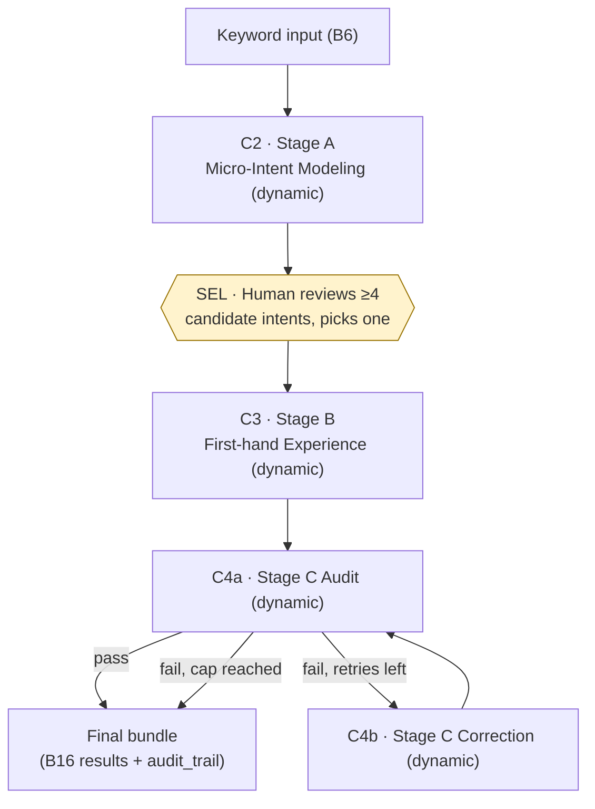

<!--
Traceability:
  Generated by: prompts/master-prompt.md → build-topic-executables, {#}=1
  Source: topic-1-prompt-chaining/docs/problem-statement-categorized.md
-->

# Topic 1 — Component Specs: Prompt Chaining

## Run notes (step 6 feasibility statement)
Building specs was feasible; two non-blocking ambiguities, both flagged as
engineering defaults rather than sourced requirements:

1. **Micro-intent selection — resolved.** B10 says Stage B operates on "one of
   the above" micro-intents but the source never specifies a selection rule.
   Decided: a human-facing selection screen — Stage A's ≥4 candidate intents
   are presented to a person, who picks one before Stage B runs. This is a
   deliberate engineering choice beyond the literal source text (topic 1's
   deliverables don't ask for a UI the way topic 2's do), and it changes C1
   from a single blocking function into two resumable steps — see the C1 spec
   below.
2. **Stage C retry cap.** B14/B15 require a "self-correction chain" but state
   no maximum number of audit↔correct cycles, unlike topic 4's explicit
   Maximum Iterations requirement (its B15). Default: cap at 3 cycles, then
   surface the last state with `pass: false` rather than looping forever.
   `[needs review]` — confirm 3 is an acceptable default, or specify one.
3. **Keyword genericized beyond B6.** B6 literally reads "Stage A's fixed
   input is the keyword [娛樂城]" — a single hardcoded keyword, not a runtime
   parameter. All four prompt templates (`prompts/*.md`) originally hardcoded
   [娛樂城] directly in their Goal/Reference/Role text in addition to
   `src/prompts.py` already taking `keyword` as a function argument, meaning
   changing `--keyword` at the CLI had no real effect — the templates still
   asserted [娛樂城] regardless. Fixed by replacing every hardcoded mention
   with a `{keyword}` placeholder, substituted at render time in
   `prompts.py`'s `_load()`, and threading the session's stored `keyword`
   through `stage_b_prompt`/`stage_c_audit_prompt` in `orchestrator.py` (only
   `stage_a_prompt` received it before). This is an engineering decision
   beyond B6's literal "fixed input" wording, made because a chain that only
   works for one hardcoded keyword isn't reusable — each affected template's
   own run note documents this locally, including the one substantive
   judgment call it required: `stage-c-audit.md`'s YMYL claim ("[娛樂城]
   content is YMYL-adjacent because it involves the reader's money") was
   rewritten from an assumed fact into an instruction to *assess*
   YMYL-relevance per keyword, since that claim doesn't hold unconditionally
   for an arbitrary substituted keyword.

Also: B13 (Role) required this topic's Stage B *content* to read as a veteran
Taiwanese player's account. The categorized doc's Role section currently holds
a general "senior SEO systems engineer" persona instead of B13's table row
(commented out). That general persona is used as the default for components
C2/C4a/C4b below (no stage-specific persona was given for those), but for C3
(Stage B) the prompt in `prompts/stage-b-first-hand-experience.md` is built
directly from B13 instead — see that file's run note for why.

Deliverables B17 (Iterative Record — a shared chat-tool conversation link),
B18 (Architecture Diagram), and B19 (Rationale) are human/documentation
artifacts, not something the runtime code produces, so they have no component
here. B18 is partially satisfied by the orchestration diagram below, but still
needs a human-authored rationale (B19) alongside it.

## Component classification

| Component | Source | Type | Justification |
|---|---|---|---|
| C1 — Chain Orchestrator | B3 (umbrella), B16 | `deterministic` | Sequences stage calls, passes state between them, runs the Stage-C retry loop, assembles the final results bundle. No language understanding/generation of its own. |
| SEL — Intent Selection Screen | (design decision, not sourced) | `human` | A person reviewing Stage A's candidates and picking one is neither code nor an LLM call. `build-topic-executables` only defines deterministic/dynamic/hybrid — `human` is added here as a fourth type, matching the "Human decisions" category `project-construction-meta-prompt.md` already expects workflow diagrams to distinguish. |
| C2 — Stage A: Micro-Intent Modeling | B7 (+B1,B2,B6,B8,B9) | `dynamic` | Inferring plausible searcher intents and their competitive-SEO rationale requires semantic judgment, not fixed rules. |
| C3 — Stage B: First-hand Experience | B10 (+B11,B12,B13) | `dynamic` | Generating persona-voiced prose with sensory detail is inherently a language-generation task. |
| C4a — Stage C: Compliance Audit | B15 (check half) | `dynamic` | Judging EEAT/YMYL compliance and authoritativeness against qualitative principles requires interpretive judgment. |
| C4b — Stage C: Correction | B15 (correct half) + B14 | `dynamic` | Rewriting flagged prose while preserving voice and resolving only the flagged issues is generative, not mechanical. |

B14 ("build a Self-Correction prompt chain") is not a standalone component —
it is realized by C4a + C4b operating together under C1's retry loop.

## C1 — Chain Orchestrator (deterministic)

The human selection screen (SEL) splits the orchestrator into two resumable
steps rather than one blocking function — step 1 runs up to the checkpoint and
returns control to a person; step 2 resumes once they've chosen.

### Step 1 — `start_prompt_chain(keyword: str) -> IntentSelectionRequest`

**Inputs:**
- `keyword` — fixed to `"娛樂城"` per B6, but parameterized for reuse.

**Outputs:** `IntentSelectionRequest` containing:
- `stage_a_intents` — C2's full list of ≥4 micro-intents (satisfies part of B16).
- `session_id` — opaque handle so step 2 can resume the right run.

**Logic:**
1. Call C2 with `keyword` → `stage_a_intents`.
2. Persist `{session_id, keyword, stage_a_intents}` (in-memory is fine for a
   prototype; anything durable enough to survive until a human responds).
3. Return `IntentSelectionRequest` to whatever surface displays it — a CLI
   prompt, a simple page, or (if topic 2's frontend work is reused) an API
   endpoint. Not mandating a specific UI framework here; that's an
   implementation choice, not a sourced requirement.

### Step 2 — `resume_prompt_chain(session_id: str, selected_intent, retry_cap: int = 3) -> ChainResult`

**Inputs:**
- `session_id` — from step 1.
- `selected_intent` — the human's choice, one of `stage_a_intents`.
- Retry cap (config, default 3 — see run note above).

**Outputs:** `ChainResult` containing:
- `stage_a_intents`, `selected_intent` — carried forward from step 1 (satisfies
  part of B16, and records *who/what* picked the intent for traceability).
- `stage_b_final` — the accepted Stage B paragraph (post-correction if any).
- `audit_trail` — every C4a verdict and C4b revision produced during the loop
  (this *is* the artifact that shows the self-correction chain in action —
  useful both as evidence for B16 and as raw material for B17/B19).
- `final_pass` — whether the loop ended in `pass: true` or hit the retry cap.

**Logic:**
1. Look up the session from `session_id`; validate `selected_intent` is
   actually one of its `stage_a_intents` (reject otherwise — a stray or
   tampered selection shouldn't silently proceed).
2. Call C3 with `selected_intent` → `current_paragraph`.
3. Loop, up to the retry cap:
   a. Call C4a with `current_paragraph` → `verdict`.
   b. Append `verdict` to `audit_trail`.
   c. If `verdict.pass` is true, stop.
   d. Else call C4b with `current_paragraph` + `verdict.reasons` →
      `current_paragraph` (revised); append the revision to `audit_trail`;
      continue loop.
4. Return `ChainResult` with `stage_b_final = current_paragraph` and
   `final_pass = verdict.pass`.

**Error handling:**
- Any stage call (C2/C4a/C4b/C3) failing or returning unparseable output
  should not silently continue the loop with bad data — record the failure in
  `audit_trail` and stop, returning `final_pass = false` with the failure
  reason attached. (Not stated explicitly in source, but implied by B21's
  logical-consistency criterion — a chain that quietly presses on after a
  broken link isn't logically consistent.)
- An unrecognized `session_id`, or a `selected_intent` that doesn't match the
  session's `stage_a_intents`, is rejected rather than guessed at.

## Orchestration flow

Node shapes/styling distinguish node type: rectangles (C2/C3/C4a/C4b/DONE) are
dynamic LLM calls or the assembled result; the hexagon (SEL) is the one human
decision in this topic. The orchestrator (C1, not itself pictured as a box)
owns every arrow — sequencing, the step-1/step-2 split around SEL, and the
retry loop are all deterministic.
