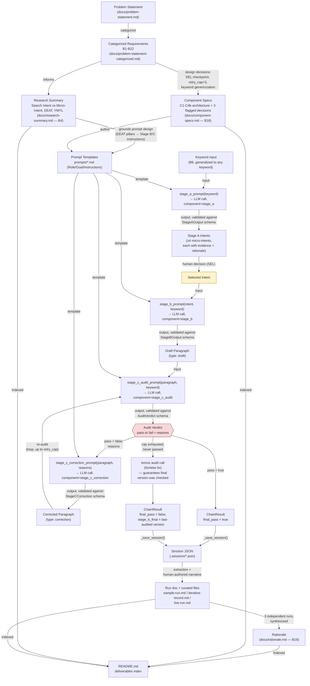

<!--
Traceability: not a sourced-requirement deliverable (no B-ID) — a walkthrough
aid requested to explain the project's actual path from problem statement to
final state to someone who already knows the domain, node-by-node.
-->

# Topic 1 — Lineage

Every node below is a concrete artifact or state that actually exists in this
repo; every link names the specific thing that produced the next node — an
input, a function call, a prompt, an output artifact, or a human decision.
Nothing here is idealized — the diagram includes the retry loop's real
3-cycle failure path, not just the happy path.

## Node-by-node walkthrough

| Node | What it is | How it was reached |
|---|---|---|
| **Problem Statement** | The original sourced task text | Given |
| **Categorized Requirements** | B1-B22, each a self-contained ID-tagged bullet | `master-prompt.md`'s `categorize-topic-requirement` procedure applied to the Problem Statement |
| **Research Summary (B4)** | Search Intent vs. Micro-Intent, EEAT, YMYL explained and mapped to specific components | Written to satisfy B4; informs *why* Stage A needs ≥4 intents and *why* Stage C audits Authoritativeness/Trustworthiness specifically |
| **Component Specs (B18)** | C1-C4b architecture, the Mermaid diagram of the mechanism itself, and 3 explicitly flagged engineering decisions beyond the literal source text (SEL human checkpoint, retry_cap=3 default, keyword genericization) | Derived from the Categorized Requirements; each non-sourced decision is flagged rather than silently made |
| **Prompt Templates** | `prompts/stage-{a,b,c-audit,c-correction}.md` — Role/Goal/Instructions per component | Authored from Component Specs' component classification + Research Summary's EEAT/YMYL grounding |
| **Keyword input** | The run's target keyword (originally hardcoded to 娛樂城 per B6; later genericized) | Provided per run (`--keyword` CLI flag / `KEYWORD` notebook variable) |
| **Stage A Intents** | ≥4 micro-intents, each with `evidence` + `competitive_rationale` | `stage_a_prompt(keyword)` → LLM call (component `stage_a`) → validated against `StageAOutput` (rejects <4 intents) |
| **Selected Intent** | One micro-intent, chosen by a person | **Human decision (SEL)** — the one non-automated step in the whole chain, by design |
| **Draft Paragraph** | First Stage B output, in the veteran-player persona | `stage_b_prompt(intent, keyword)` → LLM call (component `stage_b`) → validated against `StageBOutput` |
| **Audit Verdict** | `{pass, reasons, authoritativeness_suggestions}` | `stage_c_audit_prompt(paragraph, keyword)` → LLM call (component `stage_c_audit`) → validated against `AuditVerdict` |
| **Corrected Paragraph** | A revision resolving only the flagged `reasons` | `stage_c_correction_prompt(paragraph, reasons)` → LLM call (component `stage_c_correction`) → validated against `StageCCorrection`; loops back to another audit |
| **Bonus audit (cap-exhaustion path)** | A guarantee, not a happy-path step | Only triggered if every cycle within `retry_cap` fails — the `for`/`else` fix ensures the version finally returned was itself checked, never just-generated-and-handed-back |
| **ChainResult** | `{stage_a_intents, selected_intent, stage_b_final, audit_trail, final_pass}` | Assembled once the loop exits (via pass, or via cap exhaustion + bonus audit) |
| **Session JSON** | The full run's raw state | `_save_session()` — local, gitignored |
| **Run doc + curated files** | Human-narrated, provenance-labeled record of one run | Extracted from the session JSON + written up (`sample-run.md`, `iterative-record.md`, `live-run.md`) |
| **Rationale (B19)** | Technical explanation of how the design enforces EEAT compliance, drawing on all 3 runs | Synthesized across the fixture, in-session, and live-Azure runs — including the live run's `final_pass: false` outcome and the bug it surfaced |
| **README.md** | The deliverables index | Maps every artifact above back to the B-ID it satisfies |

## What the red/yellow nodes mean

- **Yellow (Selected Intent)** — the one point in the entire chain that is a
  human decision, not a model call or deterministic code.
- **Red (Audit Verdict)** — the one point that branches the whole run's
  outcome; every other arrow is either deterministic control flow or an LLM
  call feeding a schema, but this node's `pass`/`fail` value is what decides
  whether the loop continues, exits successfully, or eventually forces the
  bonus-audit safety path.
