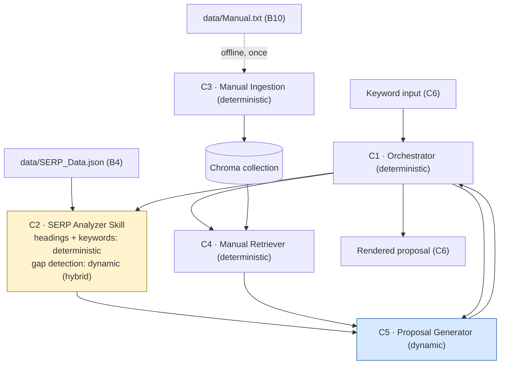
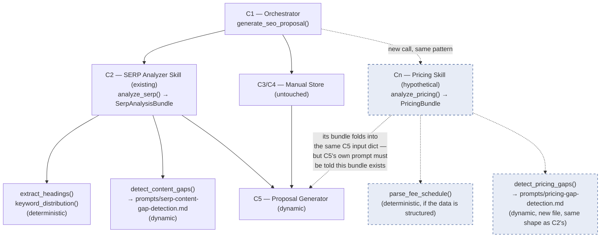

<!--
Traceability:
  Generated by: prompts/master-prompt.md → build-topic-executables, {#}=2
  Source: topic-2-rag-serp-analyzer/docs/problem-statement-categorized.md
-->

# Topic 2 — Component Specs: RAG SERP Analyzer

## Run notes (step 6 feasibility statement)

Building specs was feasible; one non-blocking finding worth flagging up front
(not a sourced requirement, a classification call):

**B8 (content-gap detection) is not purely deterministic.** Checked
`data/SERP_Data.json`'s actual shape — `{rank, title, h2, snippet,
source_authority}`, no pain-point field or fixed vocabulary to match
against. Identifying an implicit reader need that none of the top-5 results
address requires semantic judgment over unstructured heading/snippet text —
the same category of task as topic 1's Stage A micro-intent inference. So
the SERP Analyzer Skill (B5) is **hybrid**: heading extraction (B6) and
keyword-distribution counting (B7) are deterministic field reads, but gap
detection (B8) wraps one dynamic call
(`prompts/serp-content-gap-detection.md`).

Two engineering defaults, not sourced requirements — flagged rather than
silently picked, same convention as topic 1's retry-cap default:
1. **Retrieval top-k.** B11 says the system must retrieve "the corresponding
   compliance and writing recommendations" but states no count. Default: top
   3 passages. `[needs review]`.
2. **Manual chunking strategy.** B9 says to embed Manual.txt but doesn't
   specify chunk size/overlap. Checked the actual file before picking a
   default: it has three distinct compliance rules with *no blank lines*
   between them, so a paragraph-level default (split on blank lines) would
   degenerate to one chunk covering the whole file — losing per-rule
   provenance entirely. Default: one chunk per non-empty line, which fits
   this manual's actual shape. `[needs review]` if a future, longer manual
   has rules that wrap across multiple lines — this would fragment a single
   rule mid-sentence, and a paragraph- or sentence-aware splitter would be
   needed instead.

**Found during the first live Azure run** (not visible in fixture testing,
same pattern as topic 1's retry-cap-boundary bug): C5's prompt asks for
`recommended_headings`/`compliance_notes` as plain string lists and
`keyword_guidance` as a single string, but also asks each item to "cite"
its source (a gap, a competitor pattern, a manual passage) — a real Azure
run represented that citation as a nested object (`{"heading": "...", ...}`)
instead of folding it into the string's own text, failing `ProposalOutput`
validation. Fixed at two levels: `proposal-generation.md`'s Output-shape
section and `prompts.py`'s literal JSON-shape instruction were both
tightened with an explicit "plain string, never an object" rule and
examples; `schemas.py`'s `ProposalOutput` also gained a `mode="before"`
field validator that coerces a dict-shaped item into a string (joining its
values) rather than crashing, as a B21 (Technical Rigor) safety net for
whenever a model still drifts despite the clearer prompt.

Unlike topic 1, this topic has **no human-in-the-loop checkpoint** anywhere
in its sourced requirements — B12 requires the *build process* to be
documented (a Coding Agent requirement), not a runtime human decision inside
the request/response flow itself. The orchestration below is fully
automated end to end once a keyword is entered.

## Component classification

| Component | Source | Type | Justification |
|---|---|---|---|
| C1 — Orchestrator | B3 (umbrella), B13 | `deterministic` | Sequences the Skill call, retrieval call, and Proposal Generator call, and returns the bundle. No language understanding of its own. |
| C2 — SERP Analyzer Skill | B5 (+B6, B7, B8, B21) | `hybrid` | Heading extraction (B6) and keyword-distribution counting (B7) are fixed field reads over structured JSON; content-gap detection (B8) wraps a dynamic call — see run note above. |
| C3 — Manual Ingestion | B9 (+B10) | `deterministic` | Chunking text and calling an embeddings endpoint is a fixed mechanical pipeline — embedding is a transformation, not a judgment call. |
| C4 — Manual Retriever | B11 | `deterministic` | Vector similarity search over precomputed embeddings is a fixed algorithm, not generative reasoning. |
| C5 — Proposal Generator | B13 (+B11, B14, B2, B22) | `dynamic` | Synthesizing SERP analysis and retrieved manual guidance into a coherent proposal, while keeping both sources' authority distinct, requires language generation and judgment. |
| C6 — Frontend/API | B14 (+B15 soft) | `deterministic` | Takes keyword input, calls C1, renders the result. No judgment; Next.js/React is a bonus (B15), not required for the shape of this component. |

## C1 — Orchestrator: `generate_seo_proposal(keyword)`

**Inputs:** `keyword: str`

**Outputs:** `{serp_analysis, retrieved_passages, proposal}`

**Logic:**
1. Load `data/SERP_Data.json` (shared fixture per B4).
2. Call C2 `analyze_serp(serp_data, keyword)` → SERP analysis bundle.
3. Call C4 `retrieve_manual_guidance(keyword)` → top-k manual passages.
4. Call C5 (dynamic, `prompts/proposal-generation.md`) with `(keyword,
   serp_analysis, retrieved_passages)` → the proposal.
5. Return the combined bundle to whatever called it (C6's API layer).

**Error handling:**
- If `data/SERP_Data.json` is missing or fails to parse, fail loudly with a
  clear error — do not silently proceed with an empty competitive analysis
  (B21).
- If C4 returns zero passages, do not let C5 proceed as if compliance were
  checked and clean — pass that fact through explicitly so C5's prompt (see
  its Constraints) can say the manual is silent on this keyword, rather than
  fabricating guidance.

## C2 — SERP Analyzer Skill: `analyze_serp(serp_data, keyword)`

**Inputs:** `serp_data: list[{rank, title, h2, snippet, source_authority}]`, `keyword: str`

**Outputs:** `{headings, keyword_distribution, gaps}`

**Sub-functions:**
- `extract_headings(serp_data)` — deterministic; returns `[{rank, title, h2}]`
  per result (B6).
- `keyword_distribution(serp_data, keyword)` — deterministic; counts
  occurrences of the keyword (and can be extended to near-variants) across
  each result's `title`/`h2`/`snippet` fields (B7).
- `detect_content_gaps(serp_data, keyword)` — hybrid: deterministically
  assembles the extracted headings/snippets into the dynamic call's input,
  invokes `prompts/serp-content-gap-detection.md`, then deterministically
  validates the returned `{"gaps": [...]}` shape before returning it (B8).

**Error handling:**
- A malformed or incomplete individual result (e.g. missing `h2`) should be
  skipped/flagged in that result only, not crash the whole batch (B21 —
  Technical Rigor).
- If the dynamic gap-detection call returns unparseable output, surface that
  as a partial result (`gaps: null` with an error note) rather than letting
  the whole Skill call fail silently or fabricate an empty gap list that
  looks like "no gaps found."

## C3 — Manual Ingestion: `ingest_manual(manual_path) -> None`

**Inputs:** path to `data/Manual.txt`

**Outputs:** none — side effect: populates a persistent Chroma collection.

**Logic:**
1. Read the manual text; split into paragraph-level chunks (see run note on
   chunking default).
2. Call the embedding endpoint (Azure OpenAI) once per chunk.
3. Upsert each chunk's vector into the Chroma collection, storing the chunk
   text and its source line range as metadata for provenance (so C5 can
   cite exactly which passage justified a compliance note).

**Error handling:**
- An empty or missing `Manual.txt` should fail loudly at ingestion time, not
  silently produce a permanently-empty collection that C4 then queries
  against forever without anyone noticing (B21).

## C4 — Manual Retriever: `retrieve_manual_guidance(keyword, top_k=3)`

**Inputs:** `keyword: str`, `top_k: int` (engineering default, see run note)

**Outputs:** `list[{text, score, source_line_range}]`

**Logic:** embed the keyword with the same embedding model used in C3,
similarity-search the Chroma collection, return the top-k passages with
their similarity score and provenance.

**Error handling:** if the Chroma collection is empty/uninitialized (C3
never ran), raise a clear, distinct error — C1 must be able to tell "genuinely
no relevant guidance for this keyword" (a valid, informative outcome) apart
from "the retriever isn't actually wired up" (a bug).

## C6 — Frontend/API: minimal interface

**Inputs:** user-entered keyword (form submission or API request)

**Outputs:** the rendered proposal (headings, keyword guidance, compliance
notes) in the browser

**Logic:** call C1's `generate_seo_proposal(keyword)`, render the result.
B15's Next.js/React suggestion is a bonus, not required to satisfy B14's
literal ask (a simple interface where a user enters a keyword and sees the
result).

**Error handling:** surface C1's structured errors to the user directly
(e.g. "no SERP data available," "manual guidance not found for this
keyword") rather than a blank page or an unhandled exception (B21 applies at
this boundary too).

## Orchestration flow

Node styling: the hybrid Skill (C2) is shaded to distinguish it from purely
deterministic nodes; C5, the one fully dynamic component, is shaded
separately. C3's dashed edge marks it as an offline/setup-time step, not
part of the per-request path — it runs once (or whenever `Manual.txt`
changes), not on every keyword lookup.

## Execution order (per request)

1. *(offline, once)* C3 ingests `data/Manual.txt` into the Chroma collection.
2. User enters a keyword via C6.
3. C6 calls C1's `generate_seo_proposal(keyword)`.
4. C1 calls C2, which deterministically extracts headings and keyword
   distribution, then internally calls the dynamic gap-detection prompt and
   validates its output.
5. C1 calls C4, which does a deterministic vector search against C3's
   pre-populated collection.
6. C1 calls C5 (dynamic) with C2's and C4's outputs together.
7. C1 returns the bundle to C6, which renders it.

## Scalability (B23): what adding a second Skill actually costs

Every Skill in this architecture follows the same shape C2 already does:
one or more deterministic functions, an output schema, and — only if the
Skill needs judgment rather than parsing — one dynamic sub-call with its
own prompt file. The diagram below shows a hypothetical second Skill (a
pricing/fee comparison Skill, dashed) added alongside C2, to make the
answer concrete rather than asserted.

**Genuinely additive** (new files, nothing existing is edited):
- A new module (`src/pricing_skill.py`, mirroring `skill.py`'s shape)
- A new schema class in `schemas.py` for its output (e.g. `PricingBundle`) — additive, doesn't touch `SerpAnalysisBundle`/`ProposalOutput`
- A new prompt template (`prompts/pricing-gap-detection.md`) if the Skill needs judgment, not just parsing — same Role/Goal/Instructions shape as the existing one

**Requires a small, contained edit to existing files** (worth being honest about rather than claiming this is 100% plug-in):
- **C1** needs one more function call and one more key in the bundle it assembles — a small, localized addition, not a restructure.
- **C5's own prompt** (`proposal-generation.md`) and `prompts.py`'s `proposal_prompt()` signature need to actually reference the new bundle, or the Proposal Generator has no way to know the new Skill's findings exist to use them. This is the one real coupling point in the architecture: C5 is the single place all Skills' outputs converge, so it's also the one place that must change every time a Skill is added — a new Skill can't influence the proposal without C5 being told about it.

So: **new Skills are cheap to build in isolation** (own file, own schema, own prompt, no existing Skill code touched), but **not entirely free to integrate** — C1 and C5 each need one small, predictable addition, not a redesign. That's a more accurate answer to B23 than either "fully plug-and-play" or "not scalable."
