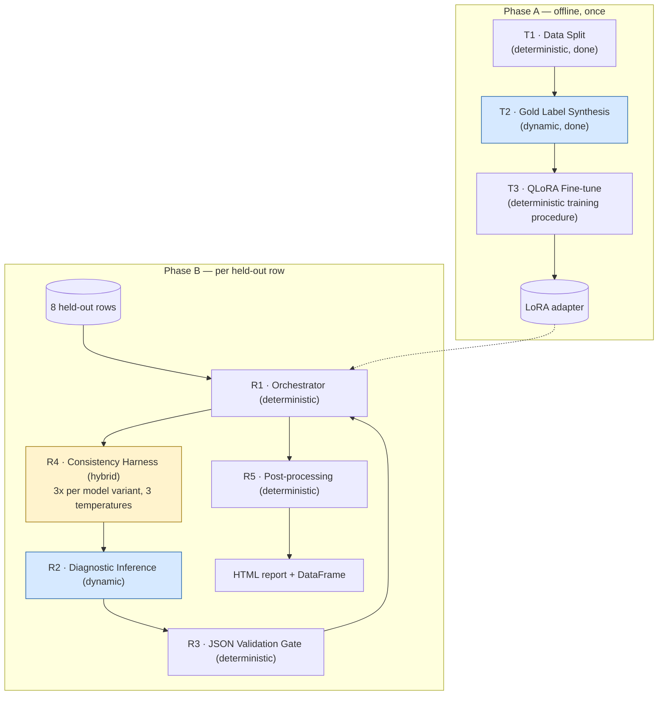

<!--
Traceability:
  Generated by: prompts/master-prompt.md → build-topic-executables, {#}=3
  Source: topic-3-local-llm-seo-diagnostics/docs/problem-statement-categorized.md
-->

# Topic 3 — Component Specs: Local LLM SEO Diagnostics

## Run notes (step 6 feasibility statement)

Building specs was feasible, with more genuinely new judgment calls than
topics 1-2 had — this topic isn't a variant of the earlier pattern, it has
two phases (training, then runtime) topics 1-2 didn't need.

**Structural note**: unlike topics 1-2, there's no `src/` package ported
into a notebook. B15 asks for *the notebook itself* as the deliverable, so
this is built directly as a Colab notebook, not generated from source files.

**Platform/model exception** (already recorded in
`problem-statement-categorized.md`'s run notes, restated here for
traceability): Colab/T4, not Kaggle Kernels (B3, B15); Llama-3-8B-Instruct.

**Found during the first live run** (not visible in the local torch-free
verification, same pattern as topics 1-2's own live-run findings):
`tokenizer.apply_chat_template(..., return_tensors="pt")` without
`return_dict=True` doesn't reliably return a bare tensor — in the
`transformers` version Colab actually installed (only a loose
`>=4.43.0` floor was pinned), it returned a dict-like `BatchEncoding`
instead, and code written assuming a bare tensor's `.shape` attribute
failed with a confusing `AttributeError` two exception layers removed
from the actual cause. Fixed in both call sites
(`generate_diagnosis`, `build_training_example`) by always passing
`return_dict=True` and pulling `input_ids`/`attention_mask` out by name —
unambiguous regardless of which version's default behavior applies.

**Also found during the first live run**: the training loop
(T3) hit `CUDA out of memory` partway through the first epoch on a T4
(14.56 GiB total), not at model-load time — the notebook attached LoRA
via `get_peft_model` directly on the 4-bit base model without first
calling `prepare_model_for_kbit_training`. That call isn't just
boilerplate: it casts norm layers to fp32 for training stability, calls
`enable_input_require_grads()` (needed for gradients to reach the LoRA
adapters through frozen, checkpointed input embeddings), and — via
`use_gradient_checkpointing=True` — turns on activation checkpointing.
Without it, backward has to hold full activations for all 32 transformer
layers of an 8B model, which reliably exceeds a T4's 15GB even though the
4-bit weights themselves only take ~6GB. Fixed by calling
`prepare_model_for_kbit_training(base_model, use_gradient_checkpointing=True)`
before `get_peft_model`, setting `model.config.use_cache = False` during
training (required alongside gradient checkpointing — the two are mutually
exclusive) and back to `True` after, for fast generation in Phase B.

**New engineering defaults, flagged rather than silently picked** (same
convention as every prior default in this project):

1. **QLoRA hyperparameters** — B3/B12 require fine-tuning but specify no
   hyperparameters. Defaults: rank `r=16`, `alpha=32`, `dropout=0.05`,
   targeting attention projections (`q_proj`, `k_proj`, `v_proj`,
   `o_proj`), 4-bit quantization (`bitsandbytes` NF4), learning rate
   `2e-4`, `3` epochs, batch size `1` with gradient accumulation `4`. All
   `[needs review]`.
2. **Training/eval seed** — fixed at `42` throughout (data split, LoRA
   init, training shuffling) for reproducibility. Not sourced, an
   engineering choice.
3. **Consistency-test temperatures** (B8) — the source says "different
   Temperature settings" but names no values. Default: `[0.1, 0.7, 1.0]` —
   low/medium/high coverage. `[needs review]`.

**Real limitation worth stating upfront, not discovering after the fact**:
**12 training examples is a very small fine-tuning set.** Overfitting risk
is genuinely high — the model could learn to imitate surface patterns in
these 12 specific examples (particular phrasing, particular score values)
rather than the underlying judgment skill. The held-out comparison (base
vs. fine-tuned on the 8 audit rows) is exactly what's designed to catch
this if it happens — and if it does happen, that's a real, reportable
finding for B18 (Reflection), not a failure to hide.

## Component classification

Two phases: **Phase A** runs once, offline, and produces an artifact (a
LoRA adapter) that Phase B depends on. **Phase B** runs per-request against
the held-out rows and is what actually gets evaluated (B16, B19-B21).

| Component | Phase | Type | Source | Justification |
|---|---|---|---|---|
| T1 — Data Split | A | `deterministic` | B12, B17 | Fixed-seed stratified split — already done, see `docs/data-split-and-labels.md`. |
| T2 — Gold Label Synthesis | A | `dynamic` (one-time) | B12 | Producing the 12 training targets requires the same reviewer judgment R2 will later learn to imitate — already done, same doc. |
| T3 — QLoRA Fine-tune | A | `deterministic` (training procedure) | B3, B12 | The training loop itself is a fixed algorithmic procedure (backprop over the 12 gold-labeled examples) — no language judgment happens at the orchestration level, even though its subject is a language model. Same reasoning topic 2 used to classify an embedding call as deterministic. |
| R1 — Orchestrator | B | `deterministic` | B13 | Loads the 8 held-out rows, calls R2 for both base and fine-tuned model variants, assembles results. |
| R2 — Diagnostic Inference | B | `dynamic` | B4, B5, B6, B7, B10, B19, B20 | The actual audit judgment call — EEAT/YMYL assessment and independent fact-verification require real language understanding, not parsing. |
| R3 — JSON Validation Gate | B | `deterministic` | B6, B21 | Schema validation — B21 grades 100% structural compliance directly, so this must reject/flag malformed output rather than silently pass it through. |
| R4 — Consistency Harness | B | `hybrid` | B8 | Deterministic orchestration (call R2 three times per snippet, at three fixed temperatures) wrapping three dynamic calls; aggregation (score variance) is computed deterministically. |
| R5 — Post-processing | B | `deterministic` | B14 | Parses validated JSON into an HTML report and a DataFrame. |

**B7 and B10/B20 are not separate components** — they're evaluation lenses
applied to R2's output on specific held-out rows (B7: rows testing legal/
factual claims in the Mortgage category; B10/B20: rows 13 and 19, the two
planted false theories held out specifically to test this — see
`docs/data-split-and-labels.md`), not additional runtime calls.

## T1 — Data Split: already executed

See `docs/data-split-and-labels.md` and `data/split_and_gold_labels.json`.
Fixed seed 42, stratified on Category × a self-derived content-type
taxonomy, with a deliberate non-proportional 2/2 split (not the general
~60/40) for the planted-false-theory rows specifically, so held-out tests
generalization rather than memorization.

## T2 — Gold Label Synthesis: already executed

Same docs. Teacher-student pattern: this session acted as the R2 persona
(`prompts/seo-diagnostic-audit.md`) to produce the 12 training targets.

## T3 — QLoRA Fine-tune: `fine_tune(train_examples, base_model) -> adapter_path`

**Inputs:** the 12 gold-labeled training examples (`data/split_and_gold_labels.json`'s `train` list), `meta-llama/Meta-Llama-3-8B-Instruct` loaded in 4-bit.

**Outputs:** a saved LoRA adapter (directory of adapter weights + config).

**Logic:**
1. Format each training example as a full prompt+completion pair:
   `prompts/seo-diagnostic-audit.md` rendered with that row's snippet/
   keyword/category as the prompt, and the gold `{score, reasons,
   actionable_advice}` JSON (verbatim) as the target completion.
2. Load the base model in 4-bit (NF4) via `bitsandbytes`; attach a LoRA
   adapter (see hyperparameters in run notes) via `peft`.
3. Train for 3 epochs over the 12 examples (batch size 1, gradient
   accumulation 4 — effective batch size 4).
4. Save the adapter (not a merged model — keeps the base model swappable
   and the artifact small).

**Error handling:** if the base model fails to load (e.g. HF license not
accepted, token missing), fail loudly with a clear message naming which
credential/step is missing — not a bare stack trace from deep inside
`transformers`.

## R1 — Orchestrator: `run_diagnostic_batch(held_out_rows, base_model, adapter_path)`

**Inputs:** the 8 held-out rows, the base model, the path to T3's saved adapter.

**Outputs:** per-row results for both model variants: `{id, category, snippet, base_result, finetuned_result}`.

**Logic:**
1. Load the base model once; load the same base model with T3's adapter
   attached as a second variant (both share the loaded weights — only the
   adapter differs — to avoid loading the 8B model twice into GPU memory).
2. For each held-out row, call R2 (via R4's consistency harness — see
   below) against both variants.
3. Assemble results, keeping base and fine-tuned outputs paired per row so
   the Audit Report (B16) can directly compare them.

**Error handling:** if a single row's inference fails or returns
unparseable JSON (per R3), record that failure in the row's result rather
than aborting the whole batch — one bad row shouldn't hide the other 7.

## R2 — Diagnostic Inference

Renders `prompts/seo-diagnostic-audit.md` with the row's snippet/keyword/
category, calls the model (base or fine-tuned variant, at a given
temperature — see R4), returns the raw text completion. Plain sampling
(`do_sample=True`, `temperature`, `top_p=0.9`) — no grammar/schema
-constrained decoding, after a real, reverted attempt at adding it (below).

**Tried and reverted: grammar-constrained decoding via `lm-format-enforcer`.**
Added after the first completed run showed 89.6% (43/48) JSON structural
validity, targeting exactly the failure mode observed (trailing commas,
unbalanced braces — pure syntax malformations, not semantic ones). Two
real live-run bugs were found and fixed along the way (a `transformers`
major-version-5 incompatibility; documented in this file's git history),
and the mechanism itself was verified locally as correctly working — but
**the actual live run on the real model made overall JSON validity worse,
not better: 33/48 (68.75%)**, and the regression was concentrated almost
entirely on the **base** (untrained) model variant — 10/24 valid (41.7%),
down sharply — while the **fine-tuned** variant actually improved to
23/24 (95.8%).

Reading the raw failed outputs directly (not just the pass/fail flag)
showed a consistent, specific signature: generation would run correctly
for a while, then stop mid-word — almost always inside a multi-byte
Chinese character like "娛" (the first character of "娛樂城") — and pad
the remaining generation budget with nothing but whitespace, never
reaching a closing brace. Not a length/`max_new_tokens` problem (it wasn't
running out of room early); it got stuck at that character boundary and
filled whatever budget remained with filler. This is consistent with a
real, specific incompatibility between `lm-format-enforcer`'s
character-level JSON parser and multi-byte UTF-8 (Chinese) content inside
a string value — a known class of problem for token-level constrained
decoders built against BPE tokenizers, where a single Chinese character
can span multiple tokens and the "allowed next token" set at that exact
boundary can degenerate to just whitespace. Local verification never
caught this because it was tested against English-only content (`gpt2`,
"Respond with a JSON object") — never against the actual Chinese content
this system handles, which is exactly where it broke.

Because the regression would corrupt R1's base-vs-fine-tuned comparison
(many of base's "failures" would become decoding artifacts, not genuine
judgment-quality differences), this was reverted rather than kept —
**decided, not silently dropped**: R2 is back to the plain-sampling
version that produced the real 89.6% result in `docs/audit-report.md`.
The evidence from the reverted attempt is preserved, not deleted:
`docs/topic3_results_v2.csv`, `docs/topic3_report_v2.html`, and the
completed-run notebook that produced them remain in the repo for
reference, and the attempted code is recoverable from the
`pre-result-quality-fixes` git tag's child commits
(`7638edb`, `a6591fb`, `c2feb5e`) if this is revisited. Two real options
for a future attempt, not pursued now: apply constrained decoding to the
fine-tuned variant only (where it demonstrably helped) while leaving base
on plain sampling; or fix the underlying UTF-8/CJK boundary issue itself
before re-enabling it for both variants.

## R3 — JSON Validation Gate: `validate(raw_output) -> AuditVerdict | ValidationError`

**Inputs:** R2's raw text output.

**Outputs:** a validated `{score: int, reasons: list[str], actionable_advice: str}` object, or a recorded validation failure.

**Logic:** parse as JSON; validate `score` is an int in `[0, 100]`,
`reasons` is a non-empty list of strings, `actionable_advice` is a
non-empty string. A local 8B model is meaningfully more likely to deviate
from the exact requested shape than a frontier hosted model was in topics
1-2 (smaller models follow format instructions less reliably) — expect to
actually exercise this failure path, not just defend against a
hypothetical one.

**Error handling:** never silently coerce or guess at a malformed response
— record it as a structural failure. **This failure rate itself is B21
evidence** (100% compliance is the criterion; the actual observed rate,
whatever it is, is what goes in the Audit Report, not an idealized claim).

## R4 — Consistency Harness: `consistency_test(row, model_variant) -> list[AuditVerdict]`

**Inputs:** one row, one model variant, the three fixed temperatures
`[0.1, 0.7, 1.0]` (run notes).

**Outputs:** three validated verdicts (via R3), one per temperature.

**Logic:** call R2 three times, once per temperature, on the *same* row and
model variant. Deterministically compute score variance across the three
runs. Qualitative consistency of `reasons`/`actionable_advice` across runs
is presented side-by-side in the report for human review (B14) rather than
scored by a second LLM judge call — keeps this component's own logic
deterministic rather than introducing another dynamic dependency just to
grade consistency.

**Error handling:** if any of the three calls fails R3's validation, report
that as a consistency-test finding in itself (a model that can't reliably
produce valid JSON at a given temperature is a real, reportable result),
not a silent retry.

## R5 — Post-processing: `render_report(results) -> (html_report, dataframe)`

**Inputs:** R1's assembled results (base + fine-tuned, all consistency-test
runs).

**Outputs:** an interactive HTML report and a `pandas.DataFrame` (B14).

**Logic:** flatten results into rows suitable for a DataFrame (one row per
held-out item × model variant × temperature); render an HTML view grouping
by held-out row so a reader can see base-vs-fine-tuned side by side per
item, plus the three-temperature consistency spread.

**Error handling:** rows that failed R3 validation are shown explicitly in
the report as failures, not dropped silently.

## Orchestration flow

Node styling: dynamic components shaded blue; the hybrid consistency
harness shaded separately. Phase A's dashed/parenthetical `ADAPTER` node
marks the one artifact crossing from offline training into the per-request
runtime path — everything else in Phase A runs once and is done.

## Execution order

1. *(offline, once)* T1 → T2 → T3, producing the adapter. T1/T2 already
   complete; T3 is the next real step.
2. For each of the 8 held-out rows, for each model variant (base,
   fine-tuned): R4 calls R2 three times (three temperatures), each result
   validated by R3.
3. R1 assembles all results; R5 renders the HTML report and DataFrame.
