<!--
Traceability: not a sourced-requirement deliverable (no B-ID) — a walkthrough
aid requested to explain the project's actual path from problem statement to
final state to someone who already knows the domain, node-by-node. Same
convention as topic-1-prompt-chaining/docs/lineage.md.
-->

# Topic 3 — Lineage

Every node below is a concrete artifact or state that actually exists in this
repo; every link names the specific thing that produced the next node — an
input, a function call, a prompt, a human decision, or a real bug and its
fix. Nothing here is idealized: the diagram includes the three live-run bugs
on the path where they actually occurred, not a happy-path abstraction of
what the notebook does when everything works on the first try.

```mermaid
flowchart TD
    PS["Problem Statement\n(docs/problem-statement.md)"]
    CAT["Categorized Requirements\nB1-B21\n(docs/problem-statement-categorized.md)"]
    TAX["Type taxonomy\n(self-derived: A-legit / B-YMYL /\nC-planted-theory / D-stuffing)"]
    SPLIT["Train/Held-out Split\ntrain=12, held-out=8\n(docs/data-split-and-labels.md)"]
    GOLD["12 Gold Labels\n(teacher-student distillation)"]
    SPEC["Component Specs\nT1-T3 / R1-R5, hyperparameters flagged\n(docs/component-specs.md)"]
    PROMPT["Complex System Prompt\n(prompts/seo-diagnostic-audit.md — B5)"]

    PS -->|"categorize"| CAT
    CAT -->|"design decisions:\nliteral QLoRA over prompting,\nColab/T4 exemption (B3/B15),\nLlama-3-8B-Instruct"| SPEC
    CAT -->|"read all 20 rows;\nfound 4 planted theories, not 1\nfound a 2nd axis beyond Category"| TAX
    TAX -->|"stratify Category x Type;\ndeliberate 2/2 split for Type C,\ndifferent claims each side"| SPLIT
    SPEC -->|"author"| PROMPT

    SPLIT -->|"train rows\n1,2,4,5,6,7,8,9,10,16,17,18"| TRAINROWS["Training rows (12)"]
    SPLIT -->|"held-out rows\n3,11,12,13,14,15,19,20"| HELDOUT["Held-out rows (8)"]
    TRAINROWS -->|"this session acts as\nthe B5 persona"| GOLD
    PROMPT -->|"same template used\nfor labels and inference"| GOLD

    GOLD -->|"render_prompt() + gold verdict\n= one training pair"| BUILDEX["build_training_example()\nx12"]
    HFMODEL["meta-llama/Meta-Llama-3-8B-Instruct\n(gated HF repo)"] -->|"live bug #1 (env, not code):\n403 GatedRepoError —\nlicense not yet accepted"| LICENSE{{"HF license accepted +\nHF_TOKEN Colab secret"}}
    LICENSE -->|"4-bit NF4 load\n(bitsandbytes)"| BASE["base_model\n(4-bit, unmodified)"]

    BUILDEX -->|"live bug #2 (fixed):\napply_chat_template's return type\nnot consistent across transformers\nversions -- fixed with return_dict=True"| TRAINEX["12 (input_ids, attention_mask,\nlabels) tensors, prompt masked -100"]
    BASE -->|"live bug #3 (fixed):\nmissing prepare_model_for_kbit_training\n-> gradient-checkpointing off\n-> OOM on T4 -- fixed"| PEFT["get_peft_model()\nLoRA r=16, alpha=32"]
    TRAINEX --> TRAINLOOP["Training loop\n3 epochs, batch 1 x grad_accum 4"]
    PEFT --> TRAINLOOP
    TRAINLOOP -->|"loss 2.51 -> 1.99 -> 1.62"| ADAPTER[("LoRA adapter\n(gitignored, ~53MB,\nreproducible not versioned)")]

    HELDOUT --> R1["R1 Orchestrator"]
    ADAPTER --> R1
    BASE --> R1
    R1 --> R4["R4 Consistency Harness\n3 temps (0.1/0.7/1.0)\nx 2 variants (base, fine-tuned)"]
    R4 -->|"generate_diagnosis()"| R2["R2 Diagnostic Inference\n(same PROMPT, both variants)"]
    R2 --> R3{{"R3 JSON Validation Gate"}}
    R3 -->|"valid: 43/48 (89.6%)"| VALID["Validated AuditVerdict\n{score, reasons, advice}"]
    R3 -->|"invalid: 5/48 --\nrecorded, not dropped"| INVALID["Recorded validation failure"]

    VALID --> RESULTS["48-row results\n(topic3_results.csv)"]
    INVALID --> RESULTS
    RESULTS -->|"R5 post-processing"| REPORT["topic3_report.html\n+ DataFrame"]

    REPORT -->|"every quote re-verified\nagainst full untruncated output"| B16["Audit Report (B16)\ndocs/audit-report.md"]
    B16 -->|"reframes B18's own\n'prompt design' question --\nsame prompt, both variants;\nfine-tune was the real lever"| B18["Reflection (B18)\ndocs/reflection.md"]

    B18 -->|"indexed"| README["README.md\ndeliverables index"]
    B16 -->|"indexed"| README
    SPEC -->|"indexed"| README

    style LICENSE fill:#fff3cd,stroke:#997404
    style R3 fill:#f8d7da,stroke:#842029
    style SPLIT fill:#fff3cd,stroke:#997404
```

## Node-by-node walkthrough

| Node | What it is | How it was reached |
|---|---|---|
| **Problem Statement** | The original sourced task text | Given |
| **Categorized Requirements** | B1-B21, each a self-contained ID-tagged bullet | `master-prompt.md`'s `categorize-topic-requirement` procedure |
| **Type taxonomy** | A-legitimate / B-YMYL-overclaim / C-planted-false-theory / D-keyword-stuffing, none of it named this way in the source | Found by reading all 20 rows individually — the source's own `Category` column (Casino/Mortgage) doesn't capture this axis |
| **Train/Held-out Split** | 12 rows to train on, 8 held out, `data/split_and_gold_labels.json` | Stratified on Category x Type, with a **deliberate, non-proportional 2/2 split for Type C** — a human design decision, not the default ~60/40 every other type got, made specifically to test generalization later |
| **Component Specs** | T1-T3 (offline, once) / R1-R5 (per held-out row) architecture, every hyperparameter flagged `[needs review]` | Derived from Categorized Requirements; explicitly names the "12 examples is a small fine-tuning set, overfitting risk is genuinely high" concern **before any run happened** |
| **12 Gold Labels** | `{score, reasons, actionable_advice}` for each of the 12 training rows | Teacher-student / distillation: this session acted directly as the B5 persona the deployed model must later imitate |
| **Complex System Prompt** | The "Google official SEO quality reviewer" persona + JSON-shape instruction | `prompts/seo-diagnostic-audit.md` — used **identically**, unchanged, for both label synthesis and every later inference call (base and fine-tuned alike) |
| **HF license / HF_TOKEN** | The one required human action, out-of-band | **Live bug #1**: a real 403 `GatedRepoError` on the first run — not a code defect, an account/license gate. Remediation given; resolution left to, and completed by, the project owner |
| **base_model** | Llama-3-8B-Instruct, 4-bit NF4 quantized | `AutoModelForCausalLM.from_pretrained(..., quantization_config=bnb_config)` |
| **12 training tensors** | `(input_ids, attention_mask, labels)`, prompt tokens masked to `-100` | `build_training_example()` — hit **live bug #2** here: `apply_chat_template`'s return type isn't consistent across `transformers` versions; fixed with `return_dict=True` at both call sites |
| **get_peft_model()** | The base model with a LoRA adapter attached | Hit **live bug #3** here: `prepare_model_for_kbit_training` was missing, so gradient checkpointing was off — reliably OOM'd an 8B model's backward pass on a 15GB T4; fixed by calling it before `get_peft_model` |
| **Training loop** | 3 epochs, batch size 1, gradient accumulation 4 | Real run: mean loss 2.51 → 1.99 → 1.62 |
| **LoRA adapter** | Saved adapter weights (~53MB) | `model.save_pretrained(...)` — gitignored; reproducible from the notebook, not versioned |
| **R1 Orchestrator** | Batches the 8 held-out rows across both model variants | Loads `base_model` once; the fine-tuned variant reuses the same weights with the adapter attached (`model.disable_adapter()` toggles between them, no second 8B load) |
| **R4 Consistency Harness** | 3 calls per row per variant, at 3 fixed temperatures | Deterministic orchestration wrapping dynamic calls — 48 calls total (8 x 2 x 3) |
| **R2 Diagnostic Inference** | The actual audit judgment call | `generate_diagnosis()` — the same Complex System Prompt every time, differing only by model variant and temperature |
| **R3 JSON Validation Gate** | Accept or reject each raw completion | Real observed rate: **43/48 valid (89.6%)** — not the idealized 100%; failures recorded, not silently dropped |
| **48-row results** | The flat table behind everything downstream | `topic3_results.csv` |
| **topic3_report.html** | Per-row, per-variant, per-temperature HTML view | R5 post-processing — the artifact the Audit Report's quotes were re-verified against, in full and untruncated |
| **Audit Report (B16)** | Score comparisons by type, row-by-row detail, verbatim quotes | Built from `topic3_report.html`/`topic3_results.csv`; every quote checked against the untruncated source before publishing (two drafting errors caught and fixed this way) |
| **Reflection (B18)** | Local model strengths/weaknesses; an explicit reframe of the question itself | Built on the Audit Report's findings — states plainly that the same prompt was used for both variants, so fine-tuning, not prompt iteration, is what this reflection actually explains |
| **README.md** | The deliverables index | Maps every artifact above back to the B-ID it satisfies |

## What the colored nodes mean

- **Yellow (HF license / HF_TOKEN)** — the one point in the entire pipeline
  that is a required human action outside the code and outside this
  session's control, analogous to topic 1's human intent-selection
  checkpoint: nothing downstream proceeds until it's done.
- **Yellow (Train/Held-out Split)** — the one point where a human design
  decision (the deliberate non-proportional 2/2 split, with different
  specific claims on each side) determines whether the entire fine-tuning
  comparison is even capable of testing generalization later, rather than
  the data shape being an automatic consequence of the source's own rules.
- **Red (R3 JSON Validation Gate)** — the one point that decides, per call,
  whether a result becomes usable evidence or a recorded failure; every
  other arrow downstream of the model calls is either deterministic
  orchestration or a schema check, but this node's accept/reject value is
  what B21's compliance rate is actually measuring.
