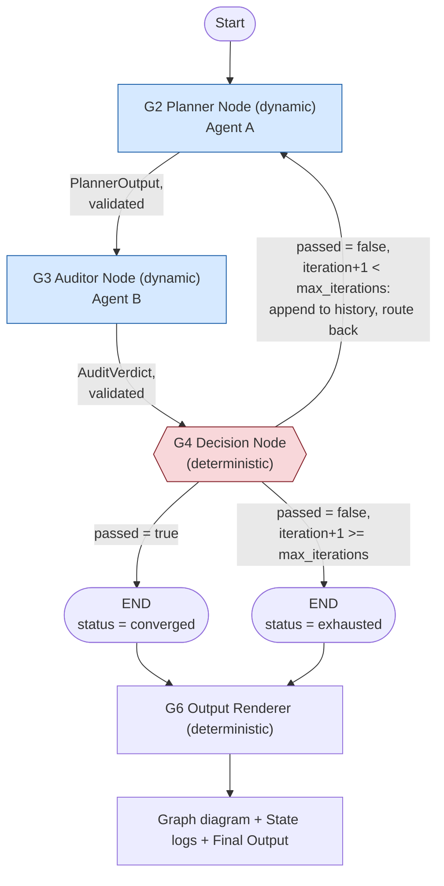

<!--
Traceability:
  Generated by: prompts/master-prompt.md → build-topic-executables, {#}=4
  Source: topic-4-multi-agent-conflict-resolution/docs/problem-statement-categorized.md
-->

# Topic 4 — Component Specs: Multi-Agent Conflict Resolution

## Run notes (step 6 feasibility statement)

Building specs was feasible; the categorized doc already resolved the two
real forks this topic had (backend choice, the Manual.txt scope mismatch —
both in `problem-statement-categorized.md`'s run notes). What's new
relative to topics 1-3: this is the first topic where the *deterministic*
orchestration itself is a named, evaluated requirement (B6's "Stateful
graph architecture," B12's graph visualization) rather than incidental
plumbing — so the graph structure is built with the real `langgraph`
package, not a hand-rolled equivalent, so that B12's visualization comes
from the library's own introspection (`get_graph().draw_mermaid()`) rather
than a hand-drawn diagram that could silently drift from what the code
actually does.

**Found during review, before any live run** (caught by the project owner
reading the generated notebook, not by executing it): the notebook
generator's first draft split "Shared imports" and "Credentials" into two
separate cells, imports second — but the Credentials cell's secrets-loading
loop uses `os` and `userdata`, both only defined in the *next* cell. Run
top-to-bottom, the Credentials cell would `NameError` before the imports
cell ever executed. Fixed by merging both into one cell (imports first,
then the secrets loop), matching topics 1-2's actual notebooks, which
already do this for exactly this reason. Re-verified by actually executing
the merged cell (with a stubbed `userdata.get`) as part of the notebook's
full end-to-end execution check, not just re-reading the fix by eye.

**New engineering defaults, flagged rather than silently picked:**

1. **`max_iterations = 5`** — B15 requires a cap but names no number.
   Generous enough that a genuinely constructive Auditor can demonstrate
   real back-and-forth (B18 explicitly checks the final output isn't a
   one-sided concession reached in a single trivial round), still bounded.
   `[needs review]`.
2. ~~**Temperatures**: Planner `0.7`, Auditor `0.1`~~ — **superseded by a
   real finding from the first live run**: the deployed Azure model
   (a GPT-5-class reasoning deployment) rejects any non-default
   temperature outright — `Error code: 400: "Unsupported value:
   'temperature' does not support 0.7 with this model. Only the default
   (1) value is supported."` `src/llm_client.py` now sends no
   `temperature` parameter at all; both agents run at the model's fixed
   default. The original reasoning (Planner should vary its revisions,
   Auditor should judge consistently) no longer has a temperature-based
   lever — it's still true in spirit, but not something this deployment
   lets the code express directly. Worth naming plainly rather than
   quietly deleting the original reasoning: this is a real platform
   constraint discovered by running the thing, the same category of
   finding as topic 1's `max_tokens` → `max_completion_tokens` fix.
3. **Retry policy for transient failures (B19)**: 3 attempts per LLM call,
   waiting 1s then 2s between them, on `RateLimitError`/`APITimeoutError`/
   `APIConnectionError` specifically — not a blanket catch-and-retry-anything,
   since a genuine content/schema problem retrying identically won't help
   and should surface as a real failure instead. `[needs review]`.

**Not built, and why**: no ChromaDB/RAG step for `Manual.txt`. At 3 lines
total it has no retrieval-discrimination to demonstrate — already named as
a known limitation in topic 2's postmortem, expected to resurface here.
Loaded as static text directly into Agent B's prompt instead.

## Component classification

| Component | Type | Source | Justification |
|---|---|---|---|
| G1 — State Schema | `deterministic` | B6, B14 | A typed data structure, no language judgment. |
| G2 — Planner Node (Agent A) | `dynamic` | B2, B4, B11 | Generating/revising an SEO outline under a competing-priorities brief requires real language generation, not parsing. |
| G3 — Auditor Node (Agent B) | `dynamic` | B2, B5, B11 | Judging compliance against written rules and producing constructive, specific revision suggestions (B18) requires language understanding, not a keyword blocklist alone (see run notes — the actual forbidden terms need a blocklist check too, but *why* something fails and what to do about it is a judgment call). |
| G4 — Decision Node | `deterministic` | B7, B8, B15, B17 | A conditional routing function over already-produced state (`audit_verdict.passed`, `iteration` vs. `max_iterations`) — no language judgment happens here, only branching logic. |
| G5 — Graph Orchestrator | `hybrid` | B3, B6, B19 | Deterministic graph wiring (`langgraph.StateGraph`, conditional edges) wrapping the two dynamic node calls; the async/retry fault-tolerance wrapper around each LLM call is itself deterministic control flow. |
| G6 — Output Renderer | `deterministic` | B12, B13, B16 | Formats final state into the three required artifacts (final outline + summary, state logs, graph diagram) — no new judgment, just structured extraction of what the graph already produced. |

## G1 — State Schema

```python
class NegotiationState(TypedDict):
    keyword: str                        # e.g. "娛樂城推薦" (B9)
    category: str                       # e.g. "Casino"
    required_ctr_terms: list[str]       # Agent A's forced high-CTR terms (B10 fixture)
    forbidden_terms: list[str]          # Agent B's forced-conflict blocklist (B10 fixture) —
                                         # NOT sourced from Manual.txt; see run notes
    compliance_reference: str           # Manual.txt's full text, loaded once, static
    outline: PlannerOutput | None       # current round's Agent A output
    audit_verdict: AuditVerdict | None  # current round's Agent B output
    iteration: int                      # 0-indexed round counter
    max_iterations: int                 # cap (default 5, see run notes)
    history: list[dict]                 # every prior round's (outline, verdict) pair — B17's
                                         # "does State fully carry prior context" requirement
    status: Literal["in_progress", "converged", "exhausted"]
```

`history` is what makes B17 concrete: the Planner's own prompt (G2) is
built by rendering `history`, not just the latest verdict, so a
Planner call on round 3 can see it already tried (and had rejected) the
specific fix it might otherwise repeat.

**Output schemas** (validated before being written into state — a
malformed response is a recorded failure, not a silent pass-through, same
convention as topics 1-3):

```python
class PlannerOutput(BaseModel):
    outline: list[str]              # non-empty; section/heading list
    keywords_used: list[str]        # non-empty; the actual CTR terms this draft leans on
    rationale: str                  # non-empty; why this draft should score well on CTR

class AuditVerdict(BaseModel):
    passed: bool
    issues: list[str]               # empty iff passed
    revision_suggestions: list[str] # empty iff passed; must be non-empty if not passed
```

## G2 — Planner Node (Agent A): `plan(state) -> PlannerOutput`

**Inputs:** `keyword`, `category`, `required_ctr_terms`, and — for any round
after the first — the most recent `audit_verdict.revision_suggestions`
plus `history` (so the prompt can say "here's what you tried before and
why it was rejected," not just "try again").

**Prompt:** `prompts/planner.md` (B4's persona).

**Output:** `PlannerOutput`, validated; on validation failure, retried once
against the same round's input before being recorded as a round failure
(not silently dropped — the whole graph run halts with a clear error
naming which round and why, per B19's fault-tolerance requirement).

**Logic:** round 0 renders the brief without any revision feedback (a
maximally CTR-driven first draft, per B10's fixture — expected to fail the
first audit). Round N>0 renders the brief **plus** the rejection reason,
instructing the Planner to address the specific issues raised without
abandoning the keyword goal entirely (grounds B18's "genuinely balance,
not one-sidedly concede" criterion in the prompt itself, not just hope for
it).

## G3 — Auditor Node (Agent B): `audit(state) -> AuditVerdict`

**Inputs:** the current round's `outline`, `compliance_reference`
(Manual.txt, static), `forbidden_terms` (B10's fixture list).

**Prompt:** `prompts/auditor.md` (B5's persona).

**Output:** `AuditVerdict`, validated the same way as G2.

**Logic:** the prompt requires an explicit blocklist check against
`forbidden_terms` (deterministic in spirit, but performed by the same
call so the Auditor can explain *why* a term is a problem in the same
pass) plus a judgment pass against `compliance_reference`'s general rules
(relevant only when the outline actually touches interest-rate/mortgage
content — for the casino fixture, `compliance_reference` will usually be
inapplicable, and the prompt says so explicitly rather than forcing an
irrelevant citation). `revision_suggestions` must name a concrete
alternative (e.g. "replace X with an honest disclosure of Y"), not just
restate the rule that was broken — this is what B18 actually grades.

## G4 — Decision Node: `decide(state) -> Literal["retry", "end"]`

**Inputs:** `audit_verdict.passed`, `iteration`, `max_iterations`.

**Logic:**
1. `passed = True` → `status = "converged"`, route to end.
2. `passed = False` and `iteration + 1 >= max_iterations` → `status =
   "exhausted"`, route to end anyway — **the outline returned is still
   the one the Auditor just evaluated and rejected**, and `status` says so
   plainly. No bonus audit call is needed here (unlike topic 1's
   retry-cap pattern): the audit that produced this round's verdict
   already *is* the audit of the version being returned.
3. Otherwise → increment `iteration`, append `(outline, audit_verdict)` to
   `history`, route back to G2.

**Error handling:** `iteration >= max_iterations` is checked defensively
even if `passed` were somehow `True` and malformed at once — routing logic
never trusts a single field in isolation for the terminal cases.

## G5 — Graph Orchestrator

Builds the actual `langgraph.graph.StateGraph(NegotiationState)`: nodes
`planner` (G2), `auditor` (G3); edges `START → planner → auditor`, then a
conditional edge from `auditor` using G4's routing function to either
`planner` (loop) or `END`.

**Fault tolerance (B19):** every LLM call inside G2/G3 is wrapped with an
async retry (`ainvoke`, 3 attempts, exponential backoff 1s/2s/4s) scoped to
transient errors (rate limit, timeout, connection) specifically — a
genuine malformed-output or content problem is not retried identically,
since retrying an unchanged prompt against a deterministic-ish failure
mode wastes calls without helping; it's recorded as a round failure
instead (see G2/G3's own error-handling above).

## G6 — Output Renderer

**Inputs:** the final `NegotiationState`, the compiled graph object.

**Outputs (the three B12/B13/B16 deliverables):**
1. **Graph Visualization (B12)** — `graph.get_graph().draw_mermaid()`,
   captured directly from the compiled LangGraph object, not hand-drawn —
   guarantees the diagram can't drift from what the code actually wires.
2. **State Logs (B13)** — `history` plus the final round, rendered as a
   readable per-round transcript: each round's outline, the specific
   phrases it leaned on, the Auditor's verdict, and (if rejected) the
   revision suggestions the next round had to address.
3. **Final Output (B16)** — the last round's `outline` plus a short,
   human-written summary of the negotiation's key turning points (what
   changed between round 0 and the final round, and why) — `status`
   reported plainly (`"converged"` vs. `"exhausted"`), not smoothed over.

## Orchestration flow



Dynamic nodes shaded blue; the Decision Node (the one point that decides
whether the negotiation continues, converges, or gives up honestly) shaded
red — same convention as topics 1 and 3's own lineage/spec diagrams.

## Execution order

1. Initialize `NegotiationState`: `keyword`/`category` from B9,
   `required_ctr_terms`/`forbidden_terms` from B10, `compliance_reference`
   loaded from `data/Manual.txt`, `iteration=0`, `max_iterations=5`,
   `history=[]`.
2. G5 invokes the compiled graph (`START → planner → auditor → decide →
   ...`), looping per G4's routing until `END`.
3. G6 renders the three deliverables from the final state.
