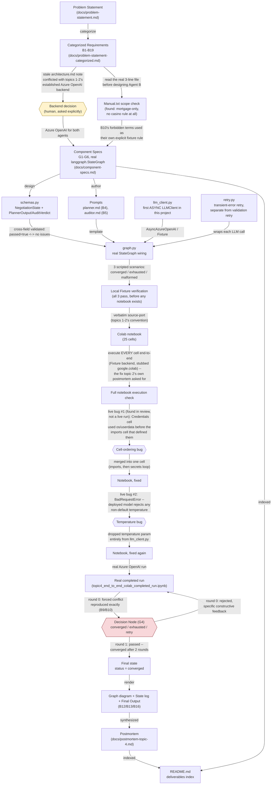

<!--
Traceability: not a sourced-requirement deliverable (no B-ID) — a walkthrough
aid requested to explain the project's actual path from problem statement to
final state to someone who already knows the domain, node-by-node. Same
convention as topic-1-prompt-chaining/docs/lineage.md and
topic-3-local-llm-seo-diagnostics/docs/lineage.md.
-->

# Topic 4 — Lineage

Every node below is a concrete artifact or state that actually exists in this
repo; every link names the specific thing that produced the next node — an
input, a function call, a prompt, a human decision, or a real bug and its
fix. Nothing here is idealized: both live-run bugs sit directly on the path
where they actually occurred, not abstracted into a happy-path diagram.

## Node-by-node walkthrough

| Node | What it is | How it was reached |
|---|---|---|
| **Problem Statement** | The original sourced task text | Given |
| **Categorized Requirements** | B1-B19, each a self-contained ID-tagged bullet | `master-prompt.md`'s `categorize-topic-requirement` procedure |
| **Backend decision** | Azure OpenAI for both agents | `docs/architecture.md` had a stale, pre-topic-1 note suggesting a local Llama model — surfaced as an explicit question rather than silently picking either side |
| **Manual.txt scope check** | Finding: the file is entirely mortgage/interest-rate-specific, no casino rule at all | Read before designing Agent B — the same "check real data first" discipline topics 2-3 already established |
| **Component Specs** | G1-G6 architecture, a real `langgraph.StateGraph` (not hand-rolled) | Derived from the categorized doc + both decisions above; specifically built so B12's diagram comes from the library's own introspection |
| **Prompts** | `prompts/planner.md` (B4), `prompts/auditor.md` (B5) | Authored from Component Specs' component classification |
| **schemas.py** | `NegotiationState` + `PlannerOutput`/`AuditVerdict`, cross-field validated | A `passed=true` verdict can't carry issues, `passed=false` can't carry none — a malformed edge case is rejected, not silently accepted |
| **llm_client.py** | The first **async** `LLMClient` Protocol in this project | B19 asks for real asynchronous handling, not a sync call wrapped in a thread |
| **retry.py** | Transient-error retry, deliberately separate from schema-validation retry | Different failure modes get different retry budgets — 3 attempts for a rate limit, 1 retry for a malformed response |
| **graph.py** | The real `Start -> Planning -> Audit -> Decision Node` wiring | `langgraph.graph.StateGraph`, with the Decision Node's state update kept separate from its routing function |
| **Local Fixture verification** | Three scripted scenarios (converged, exhausted, malformed-output) all passing | Run against the real `graph.py`, before any notebook existed, catching control-flow bugs early |
| **Colab notebook** | 25 cells, verbatim-ported from `src/` | Same convention as topics 1-2 (not topic 3's direct-authorship, since topic 4 has a real `src/` package) |
| **Full notebook execution check** | Every cell executed end-to-end (Fixture backend, stubbed `google.colab`) | The fix topic 2's own postmortem asked for, implemented for the first time here rather than just noted |
| **Cell-ordering bug** | A real bug: the Credentials cell used `os`/`userdata` before the cell that imported them | Found by the project owner reading the notebook, not by a live run — the verification above had skipped this exact cell (it needs live secrets) |
| **Temperature bug** | A real `BadRequestError`: the deployed model rejects any non-default `temperature` | Found on the first real Azure run — the same category of platform quirk as topic 1's `max_tokens` fix |
| **Real completed run** | The actual negotiation transcript | `topic4_end_to_end_colab_completed_run.ipynb` — B9/B10's forced conflict reproduced exactly |
| **Decision Node (G4)** | The one point that decides converged / exhausted / retry | In the real run: round 0 rejected with specific feedback, round 1 passed |
| **Final state** | `status = "converged"`, after 2 rounds | Agent A's revision genuinely addressed Agent B's feedback rather than one-sidedly conceding |
| **Postmortem** | Grade, what worked, what didn't, what's reusable | `docs/postmortem-topic-4.md` |
| **README.md** | The deliverables index | Maps every artifact above back to the B-ID it satisfies |

## What the colored nodes mean

- **Yellow (Backend decision)** — the one point where a human decision,
  not a model call or deterministic code, resolved a real conflict already
  sitting in the project's own docs (the stale `architecture.md` note).
- **Red (Decision Node, G4)** — the one point that branches the whole run's
  outcome; every other arrow downstream of the two agent calls is either
  deterministic orchestration or a schema check, but this node's
  converged/exhausted/retry value is what decides whether the negotiation
  continues, ends successfully, or ends having honestly failed to agree.
